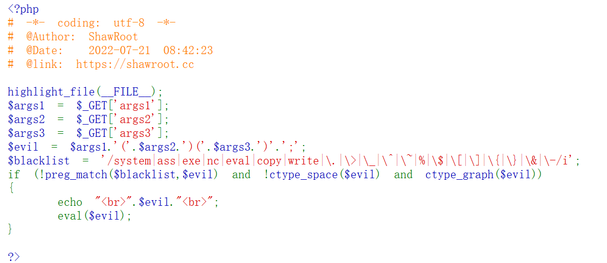
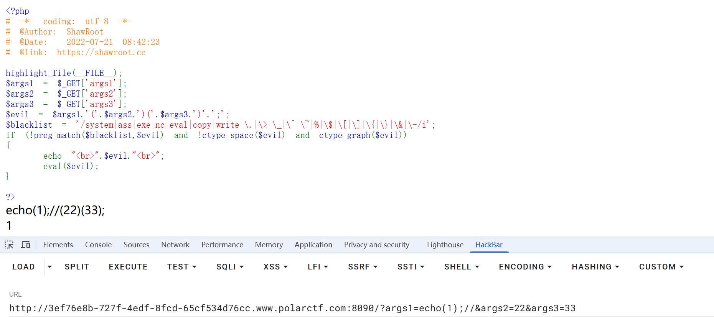
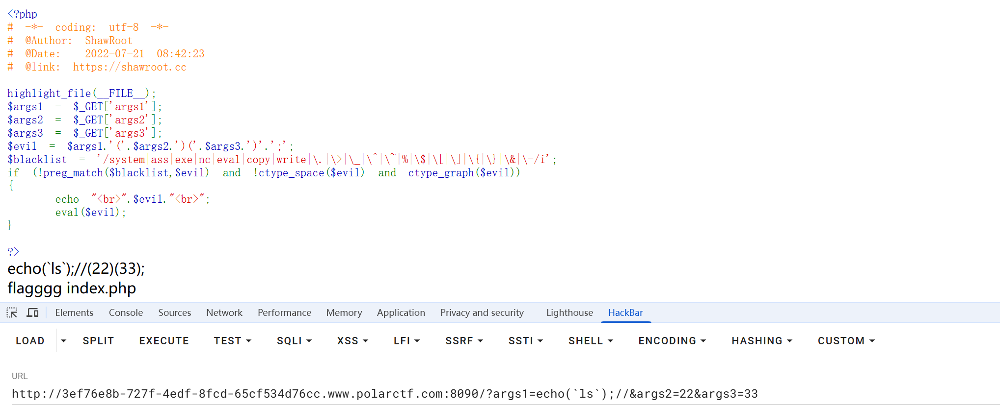

#### 非常好绕的命令执行

进入是经典的命令执行、



中间的`if`部分要求`$eval` 不含上方正则里面的词，不能只包含空白字符，且包含至少一个可打印的可见字符

由于args2和args3的变量被括号包裹，两个括号会影响后面的eval命令执行，想到在args1后面加上注释符`//`注释掉后面。



执行成功，下面就是如何rce了，可以用反引号包裹命令进行rce：



拿到flag文件名，最后使用`cat flagggg`时空格被过滤了。想到了用 < 号，**在linux系统中，< 表示重定向，将后面的文件内容当成前面命令的输入** 如 cat<a.txt ;输出的就是a.txt 的内容

payload：

```
?args1=echo(`cat<flagggg`);//
```

因为 // 注释了后面内容，args2和args3为空也可以